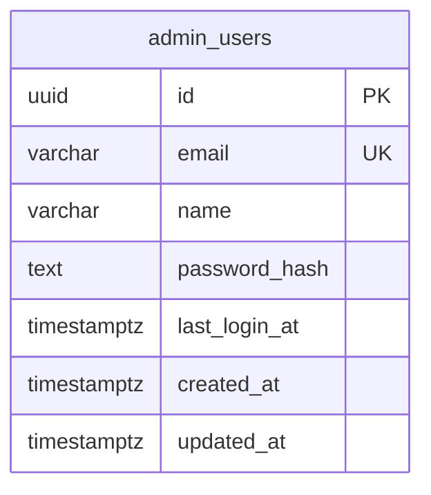

# feat: Add email/password admin login with user management

## Overview

Replace the shared `ADMIN_API_KEY` login with individual email/password admin accounts stored in Postgres. Existing admins can create new admin users from the UI. Each admin can change their own password. First admin is bootstrapped via CLI.

## Problem Statement / Motivation

The current admin login requires entering the raw `ADMIN_API_KEY` environment variable as a password. This has three problems:

1. **No accountability** — one shared credential means no way to know who did what or revoke one person's access
2. **Poor UX** — sharing a long API key is awkward, and the login page looks like a developer tool
3. **No individual access control** — removing someone's access means rotating the key for everyone

## Proposed Solution

Add an `admin_users` table with email, bcrypt-hashed password, and name. Update the login page to accept email + password. Include admin user management (create, list, delete) in the admin UI. Add self-service password change. Derive the HMAC session signing key from `ENCRYPTION_KEY` instead of `ADMIN_API_KEY`, and make `ADMIN_API_KEY` optional (then removable).

## Technical Approach

### Database

**Migration `007_add_admin_users.sql`:**

```sql
CREATE TABLE IF NOT EXISTS admin_users (
  id UUID PRIMARY KEY DEFAULT gen_random_uuid(),
  email VARCHAR(255) NOT NULL,
  name VARCHAR(255) NOT NULL,
  password_hash TEXT NOT NULL,
  last_login_at TIMESTAMPTZ,
  created_at TIMESTAMPTZ NOT NULL DEFAULT NOW(),
  updated_at TIMESTAMPTZ NOT NULL DEFAULT NOW()
);

CREATE UNIQUE INDEX idx_admin_users_email ON admin_users (LOWER(email));
```

No RLS — admin_users is a platform-level table, not tenant-scoped (same pattern as `_migrations`).

Email uniqueness is case-insensitive via `LOWER(email)` functional index. Emails stored as-entered but compared lowercase.

### Password Hashing

Use `bcryptjs` (pure JS, no native deps — works on Vercel serverless). Cost factor 12.

Add to `src/lib/crypto.ts`:
- `hashPassword(password: string): Promise<string>` — bcrypt hash
- `verifyPassword(password: string, hash: string): Promise<boolean>` — bcrypt compare

Password rules: 8 character minimum, 72 character maximum (bcrypt input limit).

### Session Changes

**Signing key:** Change `getSessionKey()` in `src/lib/admin-auth.ts` to derive from `ENCRYPTION_KEY` instead of `ADMIN_API_KEY`. Use a domain separator: `SHA-256("admin-session:" + ENCRYPTION_KEY)` to avoid key reuse with the encryption functions.

**Token payload:** Include admin user identity:
```json
{ "sub": "<admin_user_id>", "email": "<email>", "iat": 1234567890, "exp": 1234567890 }
```

**New helper:** `getAdminUserFromCookie(request): { id, email } | null` — extracts and verifies the session, returns the admin identity.

**Cookie path:** Scope to `/admin` to avoid sending the cookie on tenant API routes (currently `path: "/"`). Update `setAdminCookie()` to set two cookies: one for `/admin` (UI pages) and one for `/api/admin` (API routes).

### Auth Flow Changes

**Login (`POST /api/admin/login`):**
1. Accept `{ email, password }` instead of `{ password }`
2. Look up admin by `LOWER(email)` in `admin_users`
3. Verify password with bcrypt
4. Create session token with user ID in payload
5. Set cookie, return `{ ok: true }`
6. Rate limit per IP (existing) + per email (new: 5 attempts/min/email)

**Fallback during transition:** If `ADMIN_API_KEY` is set AND no `admin_users` rows exist, fall back to the old password-only login. This allows deploying the new code before creating the first admin. Once any admin_users exist, only email/password login works.

**Login page (`/admin/login`):**
- Add email field above password field
- Update card title/description to remove "API key" language
- During fallback mode (no admin_users), show password-only field with current behavior

### Environment Changes

**`src/lib/env.ts`:** Change `ADMIN_API_KEY` from required to optional:
```typescript
ADMIN_API_KEY: z.string().min(1).optional(),
```

**`src/lib/auth.ts`:** Remove the dead `authenticateAdmin()` function (never imported anywhere).

### Middleware

No structural changes. The middleware already uses `authenticateAdminFromCookie(request)` for admin routes. The updated function will work with the new signing key and token format transparently.

### New Types and Schemas

**`src/lib/types.ts`:** Add `AdminUserId` branded type.

**`src/lib/validation.ts`:** Add `AdminUserRow` Zod schema and request/response schemas for admin user CRUD.

### CLI Script

**`scripts/create-admin.ts`:** Following the `create-tenant.ts` pattern:
- Accept `--email`, `--name` flags
- Prompt for password interactively (no shell history) or accept `--password` for automation
- Hash password with bcrypt
- Insert into `admin_users`
- Print confirmation with email

**`package.json`:** Add `"create-admin": "npx tsx scripts/create-admin.ts"` script.

### Admin User Management UI

**New sidebar item:** "Admin Users" after Runs, using `Users` lucide icon.

**Admin Users page (`/admin/admin-users/page.tsx`):**
- Server component listing all admin users (email, name, created_at, last_login_at)
- "Create Admin" button opens a form/dialog
- Delete button per user (with confirmation) — disabled for last admin and for self
- Uses existing Card/Button/Input component patterns

**Create Admin form:**
- Fields: email, name, password (with confirmation)
- `POST /api/admin/users` → creates admin, returns to list
- Password validation: 8-72 chars

**Change Password page (`/admin/settings/page.tsx`):**
- Fields: current password, new password, confirm new password
- `POST /api/admin/change-password`
- Accessible from sidebar ("Settings" item) or from a user menu near the logout button

### API Routes

| Route | Method | Description |
|---|---|---|
| `/api/admin/login` | POST | Login (updated: email + password) |
| `/api/admin/login` | DELETE | Logout (unchanged) |
| `/api/admin/users` | GET | List all admin users |
| `/api/admin/users` | POST | Create admin user |
| `/api/admin/users/[id]` | DELETE | Delete admin user |
| `/api/admin/change-password` | POST | Change own password |

### Edge Cases

- **Deleted admin's session:** Remains valid until HMAC expiry (7 days). Acceptable for 2-5 person team — documented as intentional. For immediate revocation, another admin can rotate `ENCRYPTION_KEY` to invalidate all sessions.
- **Password change doesn't invalidate sessions:** Same trade-off as above. Stateless HMAC means existing tokens remain valid.
- **Last admin deletion:** Prevented at DB query level with a count check inside a transaction (`SELECT COUNT(*) FROM admin_users FOR UPDATE` before `DELETE`).
- **Self-deletion:** Admins cannot delete themselves — only other admins.
- **Concurrent delete race:** `FOR UPDATE` lock on the count query prevents two admins from simultaneously deleting each other.

## Acceptance Criteria

- [ ] New `admin_users` table created via migration 007
- [ ] `npm run create-admin` CLI creates the first admin user with email + hashed password
- [ ] Login page shows email + password fields and authenticates against DB
- [ ] Session cookie includes admin user ID, signed with `ENCRYPTION_KEY`-derived key
- [ ] Admin Users page lists all admins with create and delete functionality
- [ ] Cannot delete the last admin or yourself
- [ ] Change Password page allows admins to update their own password
- [ ] `ADMIN_API_KEY` is optional in env validation
- [ ] Fallback to ADMIN_API_KEY login when no admin_users exist (transition support)
- [ ] Rate limiting on login: per-IP (existing) + per-email (new)
- [ ] Cookie path scoped to `/admin` and `/api/admin`
- [ ] All existing admin-auth tests updated for new behavior
- [ ] Current user's name shown near logout button in sidebar

## Dependencies & Risks

**New dependency:** `bcryptjs` — pure JS bcrypt implementation, no native bindings. Well-maintained, widely used.

**Risks:**
- Removing `ADMIN_API_KEY` invalidates all existing sessions (acceptable — small team, one-time event)
- If CLI script is not run before removing `ADMIN_API_KEY`, the admin panel is locked out. Mitigation: fallback mode + clear docs
- `bcryptjs` is synchronous on the hash operation — for 2-5 admins this is negligible

## Implementation Order

### Phase 1: Foundation (no UI changes yet)
1. Add `bcryptjs` dependency
2. Add `hashPassword` / `verifyPassword` to `crypto.ts`
3. Create migration `007_add_admin_users.sql`
4. Add `AdminUserId` type and `AdminUserRow` schema
5. Create `scripts/create-admin.ts` CLI
6. Make `ADMIN_API_KEY` optional in `env.ts`

### Phase 2: Auth plumbing
7. Update `getSessionKey()` to use `ENCRYPTION_KEY`
8. Update session token to include user identity (`sub`, `email`)
9. Add `getAdminUserFromCookie()` helper
10. Update login route to accept email + password (with ADMIN_API_KEY fallback)
11. Update cookie path to `/admin` and `/api/admin`
12. Add per-email rate limiting
13. Remove dead `authenticateAdmin()` from `auth.ts`

### Phase 3: UI
14. Update login page (email + password fields, fallback mode)
15. Show current user name/email in sidebar near logout button
16. Add Admin Users page (list, create, delete)
17. Add Settings/Change Password page
18. Add sidebar navigation items

### Phase 4: Cleanup
19. Update all tests (`admin-auth.test.ts`, `env.test.ts`)
20. Update CLAUDE.md (remove ADMIN_API_KEY from required env vars, document new CLI)



## References & Research

- Brainstorm: `docs/brainstorms/2026-02-18-admin-login-brainstorm.md`
- Current admin auth: `src/lib/admin-auth.ts`
- Current login route: `src/app/api/admin/login/route.ts`
- Current login page: `src/app/admin/(auth)/login/page.tsx`
- Env validation: `src/lib/env.ts:17` (ADMIN_API_KEY)
- Crypto utilities: `src/lib/crypto.ts`
- CLI script pattern: `scripts/create-tenant.ts`
- Dashboard layout: `src/app/admin/(dashboard)/layout.tsx`
- Form patterns: `src/app/admin/(dashboard)/agents/[agentId]/edit-form.tsx`
- Migration pattern: `src/db/migrations/005_add_composio_mcp_cache.sql`
