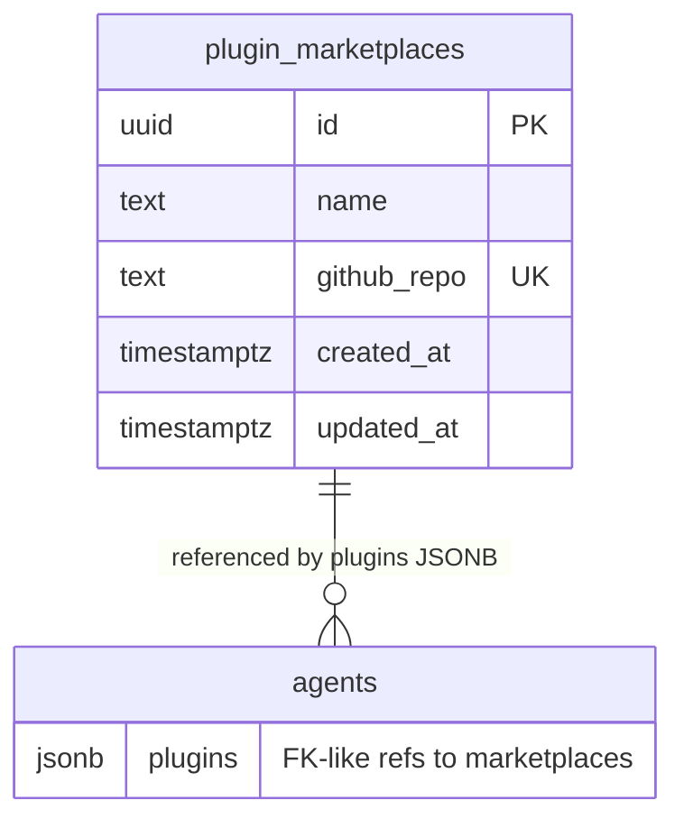

# feat: Integrate Cowork Plugin Marketplaces

## Enhancement Summary

**Deepened on:** 2026-02-18
**Sections enhanced:** 7 phases + acceptance criteria + risk analysis
**Review agents used:** Security Sentinel, Performance Oracle, Architecture Strategist, TypeScript Reviewer, Data Integrity Guardian

### Key Improvements

1. **GitHub API strategy overhaul** -- Replace Contents API (18-90 calls/plugin) with Git Trees API + `raw.githubusercontent.com` (1 API call per marketplace). Eliminates rate limit risk entirely.
2. **Module boundary correction** -- Split `github.ts` into `github.ts` (pure HTTP) + `plugins.ts` (orchestration + caching), matching the established `mcp-oauth.ts` / `mcp-connections.ts` pattern. Keep `fetchPluginContent()` out of `sandbox.ts`.
3. **Parallelized runtime** -- Run `fetchPluginContent()` in parallel with `buildMcpConfig()`, hiding plugin fetch latency behind existing MCP config latency (0ms added to critical path on warm cache).
4. **Security hardening** -- Never follow `download_url` (SSRF), validate GitHub filenames with strict regex, add per-plugin file count limit (max 20 files), enforce GITHUB_TOKEN in production.
5. **Type safety** -- Add Zod schemas for GitHub API responses, `GitHubResult<T>` discriminated union, branded `PluginMarketplaceId` in all function signatures, named interfaces for all public types.

### New Considerations Discovered

- In-memory cache is ineffective in Vercel serverless (cold starts wipe it). Plan should use DB-backed cache or Vercel KV.
- JSONB referential integrity gap: `marketplace_id` in JSONB has no FK constraint. Mitigate with existence check at PATCH time + GIN index + duplicate prevention.
- Prompt injection via plugin markdown is the highest-risk security concern. Mitigate with namespace isolation prefix and audit logging.
- Both run route call sites (`/api/runs` and `/api/admin/agents/[agentId]/runs`) must be updated for plugin fetching.

---

## Overview

Add support for Claude Cowork plugin marketplaces in AgentPlane. Admin registers GitHub repos as plugin marketplaces globally. Per-agent, admin selects which plugins to enable. At run time, plugin skills and commands are fetched from GitHub and injected into the sandbox. Plugin `.mcp.json` connector recommendations are shown as suggestions on the agent detail page.

## Problem Statement

Agents currently only have manually-authored skills. There is a growing ecosystem of community-built Cowork plugins (e.g., `anthropics/knowledge-work-plugins` with 11 role-specific plugins for sales, finance, legal, etc.) that provide high-quality skills, commands, and connector recommendations. AgentPlane needs to tap into this ecosystem so agents can leverage pre-built domain expertise without manually copying content.

## Proposed Solution

A lightweight integration that:
1. Stores marketplace repo URLs in a global registry table
2. Stores per-agent plugin selections as a JSONB column
3. Fetches plugin content from GitHub at runtime (with TTL cache)
4. Injects plugin skills/commands into the sandbox alongside existing agent skills
5. Parses `.mcp.json` from enabled plugins and shows connector suggestions

## Technical Approach

### Plugin Format Reference

From `anthropics/knowledge-work-plugins`:

**`plugin.json`:**
```json
{
  "name": "sales",
  "version": "1.0.0",
  "description": "Prospect, craft outreach, and build deal strategy faster...",
  "author": { "name": "Anthropic" }
}
```

**`.mcp.json`:**
```json
{
  "mcpServers": {
    "slack": { "type": "http", "url": "https://mcp.slack.com/mcp" },
    "hubspot": { "type": "http", "url": "https://mcp.hubspot.com/anthropic" }
  }
}
```

**Directory structure:**
```
plugin-name/
├── .claude-plugin/plugin.json
├── .mcp.json
├── commands/*.md
└── skills/*/SKILL.md       (each skill is a subdirectory with one SKILL.md)
```

### Architecture



### Module Architecture

Following the established `mcp-oauth.ts` (HTTP) / `mcp-connections.ts` (orchestration) pattern:

| Layer | Module | Responsibility |
|-------|--------|---------------|
| HTTP client | `src/lib/github.ts` | Pure GitHub API calls (Trees, raw content). No caching, no DB, no plugin awareness. |
| Orchestration | `src/lib/plugins.ts` | Plugin discovery, file resolution, caching, DB queries for marketplace resolution. |
| Config builder | `src/lib/sandbox.ts` | Receives pre-resolved files, writes to sandbox. No external I/O added. |

### Implementation Phases

#### Phase 1: Database + Types + Validation

**Migration `008_add_plugin_marketplaces.sql`:**

```sql
-- Global table, no RLS (admin-only writes enforced at app layer)
-- Trade-off: JSONB on agents for plugin associations instead of a join table.
-- Acceptable for low cardinality (max 20 plugins/agent). If per-plugin state
-- (pinned versions, enable/disable) is ever needed, refactor to a join table.
CREATE TABLE IF NOT EXISTS plugin_marketplaces (
  id UUID PRIMARY KEY DEFAULT gen_random_uuid(),
  name TEXT NOT NULL,
  github_repo TEXT NOT NULL UNIQUE,  -- e.g. 'anthropics/knowledge-work-plugins'
  created_at TIMESTAMPTZ NOT NULL DEFAULT now(),
  updated_at TIMESTAMPTZ NOT NULL DEFAULT now()
);

CREATE TRIGGER plugin_marketplaces_updated_at
  BEFORE UPDATE ON plugin_marketplaces
  FOR EACH ROW EXECUTE FUNCTION set_updated_at();

-- Agent plugins column
ALTER TABLE agents ADD COLUMN IF NOT EXISTS plugins JSONB NOT NULL DEFAULT '[]';

-- GIN index for containment queries (marketplace DELETE check)
CREATE INDEX IF NOT EXISTS idx_agents_plugins ON agents USING gin (plugins jsonb_path_ops);
```

**Branded type in `src/lib/types.ts`:**
```typescript
export type PluginMarketplaceId = string & { readonly __brand: "PluginMarketplaceId" };
```

**Domain interface in `src/lib/types.ts`:**
```typescript
export interface AgentPlugin {
  marketplace_id: PluginMarketplaceId;
  plugin_name: string;
}
```

**Zod schemas in `src/lib/validation.ts`:**

```typescript
// Plugin marketplace CRUD
export const CreatePluginMarketplaceSchema = z.object({
  name: z.string().min(1).max(100),
  github_repo: z.string()
    .regex(/^[a-zA-Z0-9_.-]+\/[a-zA-Z0-9_.-]+$/, "Must be owner/repo format"),
});

export const PluginMarketplaceRow = z.object({
  id: z.string(),
  name: z.string(),
  github_repo: z.string(),
  created_at: z.coerce.date(),
  updated_at: z.coerce.date(),
});

// Agent plugin config (stored in agents.plugins JSONB)
export const AgentPluginSchema = z.object({
  marketplace_id: z.string().uuid(),
  plugin_name: z.string().min(1).max(100).regex(/^[a-z0-9-]+$/),
});

export const AgentPluginsSchema = z.array(AgentPluginSchema)
  .max(20)
  .refine(
    (plugins) => {
      const keys = plugins.map(p => `${p.marketplace_id}:${p.plugin_name}`);
      return new Set(keys).size === keys.length;
    },
    { message: "Duplicate plugin entries are not allowed" },
  );

// Plugin manifest (fetched from GitHub)
export const PluginManifestSchema = z.object({
  name: z.string().min(1).max(100).regex(/^[a-z0-9-]+$/, "Plugin name must be lowercase alphanumeric with hyphens"),
  version: z.string().max(50).optional(),
  description: z.string().max(2000).optional(),
  author: z.object({ name: z.string().max(200) }).optional(),
});

// Plugin .mcp.json (fetched from GitHub)
export const PluginMcpJsonSchema = z.object({
  mcpServers: z.record(
    z.string().min(1).max(100),
    z.object({
      type: z.string().min(1).max(50),
      url: z.string().url(),
    }),
  ).optional(),
});

// GitHub API response schemas
export const GitHubTreeEntrySchema = z.object({
  path: z.string(),
  mode: z.string(),
  type: z.enum(["blob", "tree"]),
  sha: z.string(),
  size: z.number().optional(),
  url: z.string(),
});

export const GitHubTreeResponseSchema = z.object({
  sha: z.string(),
  tree: z.array(GitHubTreeEntrySchema),
  truncated: z.boolean(),
});

// Safe filename for plugin files from GitHub
export const SafePluginFilename = z.string()
  .min(1).max(255)
  .regex(/^[a-zA-Z0-9_-]+\.md$/, "Must be a .md file with safe characters only");

// Extend AgentRow with plugins (add to existing schema)
// plugins: z.array(AgentPluginSchema).default([]).catch([]),
```

### Research Insights: Phase 1

**Data Integrity:**
- The JSONB approach lacks FK constraints. Mitigate by validating `marketplace_id` existence at PATCH time (see Phase 5) and adding a GIN index for containment queries.
- Add duplicate prevention via `.refine()` on `AgentPluginsSchema` to prevent the same `(marketplace_id, plugin_name)` pair from appearing twice.
- Use `.default([]).catch([])` on `AgentRow.plugins` to handle existing rows and malformed JSONB gracefully (matching existing `skills` pattern).

**Type Safety:**
- `PluginManifestSchema.name` regex must match `AgentPluginSchema.plugin_name` regex (`/^[a-z0-9-]+$/`) to prevent validation mismatches at runtime.
- Add `GitHubTreeEntrySchema` and `GitHubTreeResponseSchema` for validating GitHub API responses at the boundary (matching `OAuthMetadataSchema` pattern).

**Files:**
- `src/db/migrations/008_add_plugin_marketplaces.sql`
- `src/lib/types.ts` -- add `PluginMarketplaceId`, `AgentPlugin`
- `src/lib/validation.ts` -- add schemas above, extend `UpdateAgentSchema` with optional `plugins` field, extend `AgentRow` with `plugins`

---

#### Phase 2: GitHub API Client + Caching

**New module `src/lib/github.ts` -- Pure HTTP client (no caching, no DB):**

```typescript
// GitHub API HTTP client -- pure HTTP, no caching, no plugin awareness.
// Mirrors mcp-oauth.ts pattern (pure HTTP layer).

// GitHubResult<T> -- explicit success/failure return type (no throwing)
type GitHubResult<T> =
  | { ok: true; data: T }
  | { ok: false; error: "not_found" | "rate_limited" | "server_error" | "parse_error"; message: string };

// fetchRepoTree(owner, repo, token?)
//   GET https://api.github.com/repos/{owner}/{repo}/git/trees/HEAD?recursive=1
//   Returns: GitHubResult<GitHubTreeEntry[]>
//   Single API call returns entire repo structure (paths, SHAs, sizes)

// fetchRawContent(owner, repo, path, token?)
//   GET https://raw.githubusercontent.com/{owner}/{repo}/HEAD/{path}
//   Returns: GitHubResult<string>
//   NOT rate-limited like the API; served from CDN (~50-80ms)
//   Validates response is valid UTF-8 text (no null bytes/control chars)
```

Key implementation details:
- **NEVER follow `download_url`** from any GitHub API response (SSRF risk). Always use `raw.githubusercontent.com` with programmatically constructed URLs.
- Hardcode `api.github.com` and `raw.githubusercontent.com` as the only outbound hosts.
- All functions return `GitHubResult<T>` (never throw) -- makes "skip failed plugins" trivially implementable at the orchestration layer.
- Parse all GitHub API responses through Zod schemas (`GitHubTreeResponseSchema`) before use.
- Validate fetched file content is valid UTF-8: reject null bytes and non-printable characters.
- Content size limit: 100KB per file (matching existing skill file limit).
- Access `GITHUB_TOKEN` via `getEnv().GITHUB_TOKEN` (never read `process.env` directly).

**New module `src/lib/plugins.ts` -- Orchestration layer (caching + DB):**

```typescript
// Plugin orchestration -- caching, DB queries, plugin discovery.
// Mirrors mcp-connections.ts pattern (orchestration layer).

// Named types for public API
export interface PluginListItem {
  name: string;
  description: string | null;
  version: string | null;
  author: string | null;
  hasSkills: boolean;
  hasCommands: boolean;
  hasMcpJson: boolean;
}

export interface PluginContent {
  skills: Array<{ name: string; content: string }>;
  commands: Array<{ name: string; content: string }>;
  mcpJson: z.infer<typeof PluginMcpJsonSchema> | null;
}

// Cache: process-level Map with TTL (same pattern as serverCache in mcp-connections.ts)
// Key: "${owner}/${repo}" for trees, "${owner}/${repo}/${pluginName}" for plugin content
// Value: discriminated union by kind

// listPlugins(githubRepo)
//   1. Fetch repo tree (cached)
//   2. Identify top-level directories with .claude-plugin/plugin.json
//   3. Fetch and parse each plugin.json
//   Returns: PluginListItem[]

// fetchPluginContent(plugins: AgentPlugin[])
//   1. Query plugin_marketplaces table to resolve marketplace_id -> github_repo
//   2. Group plugins by marketplace (one tree fetch per marketplace, not per plugin)
//   3. For each plugin, filter tree for skills/*/SKILL.md, commands/*.md, .mcp.json
//   4. Fetch file contents via raw.githubusercontent.com (parallel)
//   5. Validate filenames with SafePluginFilename, enforce max 20 files per plugin
//   6. Return separate skill and command file arrays
//   Returns: { skillFiles: SandboxFile[]; commandFiles: SandboxFile[]; warnings: string[] }
```

### Research Insights: Phase 2

**Performance (Critical):**
- **Use Git Trees API** (`GET /repos/{owner}/{repo}/git/trees/HEAD?recursive=1`) instead of Contents API. Returns entire repo tree in 1 API call vs 18-90 calls per plugin. Then fetch file contents from `raw.githubusercontent.com` (CDN, not rate-limited).
- **Group plugins by marketplace.** An agent with 5 plugins from the same repo needs 1 tree fetch, not 5.
- **In-memory cache is unreliable in serverless.** Vercel functions cold-start frequently, wiping the `Map`. For v1, the in-memory cache is acceptable (it still helps during warm periods). If cache miss rates are high in production, upgrade to DB-backed cache or Vercel KV.

**Security:**
- **Never follow `download_url`** from GitHub API responses. An attacker controlling a repo could redirect it to internal IPs (cloud metadata `169.254.169.254`, internal Neon endpoints). Always construct URLs programmatically.
- **Validate filenames** from the tree with `SafePluginFilename` regex (`/^[a-zA-Z0-9_-]+\.md$/`) before using them in path construction. Reject anything with slashes, `..`, or null bytes.
- **Per-plugin file count limit:** Max 20 files per plugin to prevent a malicious repo from triggering thousands of raw content fetches.
- **Validate UTF-8:** After fetching, reject content with null bytes or non-printable characters.

**Architecture:**
- Split into `github.ts` (HTTP) + `plugins.ts` (orchestration) -- matching `mcp-oauth.ts` / `mcp-connections.ts` separation.
- Cache belongs in `plugins.ts` (orchestration layer), not `github.ts` (HTTP layer).

**Files:**
- `src/lib/github.ts` -- pure HTTP client
- `src/lib/plugins.ts` -- orchestration, caching, DB queries
- `src/lib/env.ts` -- add optional `GITHUB_TOKEN` (required in production, log warning if missing)

---

#### Phase 3: Admin API Routes for Marketplaces

Follow the `mcp-servers` route pattern.

**`src/app/api/admin/plugin-marketplaces/route.ts`:**
- `GET` -- list all marketplaces (query `plugin_marketplaces` table)
- `POST` -- register new marketplace (validate github_repo format, check uniqueness, validate repo exists by fetching tree from GitHub API)

**`src/app/api/admin/plugin-marketplaces/[marketplaceId]/route.ts`:**
- `GET` -- get marketplace details
- `DELETE` -- delete marketplace. Use atomic check-and-delete in a single transaction with row locking to prevent TOCTOU race:
  ```sql
  BEGIN;
  SELECT id FROM agents WHERE plugins @> '[{"marketplace_id": "<id>"}]' FOR UPDATE;
  -- If count > 0: ROLLBACK, return 409 Conflict
  -- If count = 0: DELETE FROM plugin_marketplaces WHERE id = $1
  COMMIT;
  ```

**`src/app/api/admin/plugin-marketplaces/[marketplaceId]/plugins/route.ts`:**
- `GET` -- list available plugins in this marketplace (live fetch from GitHub via `listPlugins()`)

### Research Insights: Phase 3

**Security:**
- The DELETE race condition (TOCTOU) is real: between checking agent references and deleting the marketplace, another admin could PATCH an agent to add a reference. The atomic transaction with `FOR UPDATE` prevents this.
- Sanitize GitHub API error responses before returning to clients (e.g., "Failed to fetch plugins from GitHub" rather than leaking raw error details).

**Data Integrity:**
- The GIN index from Phase 1 (`idx_agents_plugins`) ensures the containment query (`plugins @> '[{"marketplace_id": "..."}]'`) is fast even with many agents.

**Files:**
- `src/app/api/admin/plugin-marketplaces/route.ts`
- `src/app/api/admin/plugin-marketplaces/[marketplaceId]/route.ts`
- `src/app/api/admin/plugin-marketplaces/[marketplaceId]/plugins/route.ts`

---

#### Phase 4: Admin UI -- Marketplace Management Page

Follow the `mcp-servers` page pattern.

**`src/app/admin/(dashboard)/plugin-marketplaces/page.tsx`:**
- Server component listing all marketplaces
- Shows: name, github_repo link, created date
- "Add Marketplace" dialog (name + github_repo input, validates repo on submit)
- Delete button with confirmation (warns if agents use it)
- "Refresh Cache" button to force-clear cached content for a marketplace (for incident response)

**Add nav item to layout:**
- In `src/app/admin/(dashboard)/layout.tsx`, add to `navItems` array:
  `{ href: "/admin/plugin-marketplaces", label: "Plugins", icon: Puzzle }`

**Files:**
- `src/app/admin/(dashboard)/plugin-marketplaces/page.tsx`
- `src/app/admin/(dashboard)/layout.tsx` -- add nav item

---

#### Phase 5: Agent Plugin Selection (API + UI)

**API changes:**
- Extend `PATCH /api/admin/agents/[agentId]` to accept `plugins` field (add `plugins` entry to `fieldMap` with `JSON.stringify` transform)
- Add `plugins` to `AgentRow` schema so it's returned in agent API responses
- **Validate `marketplace_id` existence** before persisting:
  ```typescript
  if (input.plugins !== undefined && input.plugins.length > 0) {
    const marketplaceIds = [...new Set(input.plugins.map(p => p.marketplace_id))];
    const existing = await query(
      z.object({ id: z.string() }),
      "SELECT id FROM plugin_marketplaces WHERE id = ANY($1)",
      [marketplaceIds],
    );
    const existingIds = new Set(existing.map(r => r.id));
    const missing = marketplaceIds.filter(id => !existingIds.has(id));
    if (missing.length > 0) {
      throw new ValidationError(`Unknown marketplace IDs: ${missing.join(", ")}`);
    }
  }
  ```

**New component `src/app/admin/(dashboard)/agents/[agentId]/plugins-manager.tsx`:**

Client component that:
1. Fetches all registered marketplaces via `GET /api/admin/plugin-marketplaces`
2. For each marketplace, fetches available plugins via `GET /api/admin/plugin-marketplaces/[id]/plugins`
3. Shows plugins grouped by marketplace with checkboxes
4. Each plugin shows: name, description (from plugin.json)
5. Checked state is driven by agent's `plugins` JSONB
6. On toggle, PATCHes agent with updated `plugins` array
7. Loading/error states for GitHub API failures

**Integration in agent detail page:**
- Add `<PluginsManager>` section to `src/app/admin/(dashboard)/agents/[agentId]/page.tsx`, between Skills and Connectors sections

### Research Insights: Phase 5

**Data Integrity:**
- The `marketplace_id` existence check prevents storing dangling references. Without this, a typo or race could silently store an invalid UUID that fails at runtime.
- `AgentPluginsSchema` duplicate prevention (`.refine()`) prevents the same `(marketplace_id, plugin_name)` from appearing twice.

**Performance:**
- **Pre-warm cache on plugin config change:** After PATCH saves plugins, fire-and-forget a `fetchPluginContent()` call to populate the cache. The next run hits a warm cache.
  ```typescript
  if (updatedFields.includes('plugins')) {
    fetchPluginContent(newPlugins).catch(err =>
      logger.warn("Plugin cache pre-warm failed", { error: err.message })
    );
  }
  ```

**Files:**
- `src/app/api/admin/agents/[agentId]/route.ts` -- add `plugins` to fieldMap, add marketplace_id validation
- `src/lib/validation.ts` -- add `plugins` to `AgentRow` with `.default([]).catch([])`, `UpdateAgentSchema`
- `src/app/admin/(dashboard)/agents/[agentId]/plugins-manager.tsx` -- new component
- `src/app/admin/(dashboard)/agents/[agentId]/page.tsx` -- add PluginsManager section

---

#### Phase 6: Runtime Plugin Injection

**Where this happens in the existing flow:**

The current sandbox creation flow in `createAndRunSandbox()` is:
1. `buildMcpConfig()` -- resolves Composio + custom MCP servers
2. `sandbox.create()` -- creates the Vercel Sandbox
3. `sandbox.writeFiles()` -- writes agent skills + runner script
4. Runner executes Claude Code

**Plugin fetching runs in parallel with `buildMcpConfig()` (not sequentially):**

```typescript
// In both run route call sites:
const [mcpResult, pluginResult] = await Promise.all([
  buildMcpConfig(agent, auth.tenantId),
  fetchPluginContent(agent.plugins ?? []),  // from src/lib/plugins.ts
]);

const sandbox = await createSandbox({
  ...config,
  mcpServers: mcpResult.servers,
  mcpErrors: mcpResult.errors,
  pluginSkillFiles: pluginResult.skillFiles,    // pre-resolved files
  pluginCommandFiles: pluginResult.commandFiles, // pre-resolved files
});
```

**`SandboxConfig` receives pre-resolved files (not raw plugin references):**

```typescript
export interface SandboxConfig {
  // ...existing fields...
  pluginSkillFiles?: Array<{ path: string; content: string }>;
  pluginCommandFiles?: Array<{ path: string; content: string }>;
}
```

This keeps `sandbox.ts` as a pure sandbox builder with no new external I/O. It only writes the pre-resolved files alongside existing agent skills.

**File naming:**
- Skills: `.claude/skills/<plugin-name>-<filename>.md`
- Commands: `.claude/commands/<plugin-name>-<filename>.md`
- Both go through existing path traversal validation (`path.resolve()` + `startsWith()` check)
- Command files need a NEW `commandsRoot` check (existing code only validates against `skillsRoot`)

**Error handling:** If a plugin fetch fails (GitHub down, repo deleted, rate limited), `fetchPluginContent()` collects warnings and skips that plugin. Warnings are included in the run's `mcpErrors` array. The run proceeds with whatever content was successfully fetched.

### Research Insights: Phase 6

**Performance (Critical):**
- Parallelizing `fetchPluginContent()` with `buildMcpConfig()` hides plugin fetch latency behind existing MCP config latency (500ms-2s for Composio calls). **Estimated savings: 600ms-3s per run on cold cache.**
- `buildMcpConfig()` is already the dominant latency contributor. Plugin fetching completes before it finishes in most cases.

**Architecture:**
- `fetchPluginContent()` lives in `src/lib/plugins.ts` (orchestration layer), NOT in `sandbox.ts`. Sandbox receives pre-resolved file arrays.
- **Both run route call sites must be updated:** `src/app/api/runs/route.ts` and `src/app/api/admin/agents/[agentId]/runs/route.ts`.

**Security:**
- **Prompt injection via plugin markdown** is the highest-risk concern. Plugin skills become part of Claude's context. Mitigate with:
  1. Namespace isolation: prefix plugin skill content with a boundary marker (e.g., `<!-- Community plugin: {name} -->`) so Claude understands the trust level
  2. Audit logging: log the SHA and size of every plugin file injected into a sandbox
- **Path traversal via filenames:** Validate all filenames from GitHub with `SafePluginFilename` regex before path construction. Add a `commandsRoot` check alongside the existing `skillsRoot` check.
- **Check file sizes from tree before fetching:** The tree response includes `size` for each blob. Skip files >100KB without fetching content.

**Files:**
- `src/lib/plugins.ts` -- `fetchPluginContent()` orchestration
- `src/lib/sandbox.ts` -- extend `SandboxConfig` interface, extend file writing to include `pluginSkillFiles` and `pluginCommandFiles`, add `commandsRoot` path traversal check
- `src/app/api/runs/route.ts` -- add parallel `fetchPluginContent()` call
- `src/app/api/admin/agents/[agentId]/runs/route.ts` -- add parallel `fetchPluginContent()` call

---

#### Phase 7: Connector Suggestions

**New API route `src/app/api/admin/agents/[agentId]/plugin-suggestions/route.ts`:**
- `GET` -- returns connector suggestions from enabled plugins
- For each enabled plugin, fetches `.mcp.json` via GitHub API (cached)
- Extracts server keys (e.g., "slack", "hubspot")
- Maps to Composio toolkit slugs via explicit mapping with uppercase fallback:
  ```typescript
  const MCP_TO_COMPOSIO_MAP: Record<string, string> = {
    slack: "SLACK",
    hubspot: "HUBSPOT",
    // add more as discovered
  };
  function toComposioSlug(key: string): string {
    return MCP_TO_COMPOSIO_MAP[key.toLowerCase()] ?? key.toUpperCase();
  }
  ```
- Filters out toolkits already in the agent's `composio_toolkits` array
- Returns: `[{ connector_name, composio_slug, suggested_by_plugin }]`

**UI changes in `src/app/admin/(dashboard)/agents/[agentId]/connectors-manager.tsx`:**
- Fetch suggestions from the new endpoint
- Show a "Suggested by plugins" section below existing connectors
- Each suggestion shows: connector name, which plugin suggests it, Composio toolkit badge
- Informational only -- no connect button (admin manually adds the toolkit if desired)
- URLs from `.mcp.json` are validated by Zod (`z.string().url()`) which rejects `javascript:` scheme. If rendered as links, use `target="_blank" rel="noopener noreferrer"`.

**Files:**
- `src/app/api/admin/agents/[agentId]/plugin-suggestions/route.ts`
- `src/app/admin/(dashboard)/agents/[agentId]/connectors-manager.tsx` -- add suggestions section

---

## Acceptance Criteria

### Functional Requirements

- [ ] Admin can register a plugin marketplace by providing a GitHub `owner/repo` string
- [ ] Admin can delete a marketplace (blocked if agents reference it, with atomic check)
- [ ] Admin can see available plugins from registered marketplaces on the agent detail page
- [ ] Admin can enable/disable plugins per agent via checkboxes
- [ ] Plugin skills are injected into `.claude/skills/` in the sandbox at run time
- [ ] Plugin commands are injected into `.claude/commands/` in the sandbox at run time
- [ ] Plugin files are prefixed with plugin name to avoid collisions
- [ ] Connector suggestions from plugin `.mcp.json` are shown on agent detail page
- [ ] Suggestions are filtered to exclude already-connected Composio toolkits
- [ ] GitHub API responses are cached with TTL

### Non-Functional Requirements

- [ ] Plugin file size limit: 100KB per file (matches existing skill limit)
- [ ] Max 20 plugins per agent, max 20 files per plugin
- [ ] No duplicate `(marketplace_id, plugin_name)` pairs in plugins JSONB
- [ ] `marketplace_id` values validated against `plugin_marketplaces` table at PATCH time
- [ ] GitHub API failures during runs are gracefully handled (skip plugin, log warning, include in run warnings)
- [ ] No security regressions -- plugin file paths go through path traversal validation (both skills and commands roots)
- [ ] Plugin filenames from GitHub validated with strict regex before path construction
- [ ] Never follow `download_url` from GitHub API responses
- [ ] `GITHUB_TOKEN` env var supported; startup warning if not set in production
- [ ] `fetchPluginContent()` runs in parallel with `buildMcpConfig()` (no added latency on critical path)

### Quality Gates

- [ ] `npx next build` passes (type-check + build)
- [ ] `npx vitest run` passes
- [ ] Migration runs cleanly on existing database

## Dependencies & Prerequisites

- Current branch `feat/custom-mcp-server-registry` should be merged first (migration 007 must be applied)
- The `set_updated_at()` trigger function from migration 007 is reused

## Risk Analysis & Mitigation

| Risk | Impact | Mitigation |
|------|--------|------------|
| GitHub API rate limits (60/hr unauthenticated) | Plugin lists empty, run-time fetch fails | Git Trees API (1 call/marketplace) + `raw.githubusercontent.com` (CDN, not rate-limited) + `GITHUB_TOKEN` env var (5000/hr) |
| SSRF via `download_url` in GitHub API responses | Internal network scanning, cloud metadata exfiltration | Never follow `download_url`. Hardcode `api.github.com` and `raw.githubusercontent.com` as only outbound hosts |
| Prompt injection via malicious plugin content | Agent hijacking, secret exfiltration | Admin-only marketplace registration; namespace isolation prefix; audit logging of injected content; same sandbox isolation as regular skills |
| Path traversal via GitHub filenames | Sandbox escape, arbitrary file write | Validate filenames with `SafePluginFilename` regex; `path.resolve()` + `startsWith()` check for both skills and commands roots |
| Marketplace repo deleted/made private | Agent config page errors, runtime failures | Graceful degradation -- skip unavailable plugins with warnings |
| Plugin content too large | Sandbox file write limits exceeded | Per-file 100KB limit, max 20 files/plugin, max 20 plugins/agent |
| Serverless cold starts invalidate cache | More GitHub API calls than expected | Trees API reduces calls to 1/marketplace; cache still helps during warm periods; upgrade to DB/KV cache if needed |
| JSONB referential integrity gap | Dangling marketplace_id references | Validate existence at PATCH time; atomic DELETE with row locking; GIN index for efficient queries |
| Concurrent DELETE/PATCH race (TOCTOU) | Stale marketplace references | Atomic transaction with `FOR UPDATE` on marketplace DELETE |

## File Summary

New files:
- `src/db/migrations/008_add_plugin_marketplaces.sql`
- `src/lib/github.ts` -- pure HTTP client for GitHub API
- `src/lib/plugins.ts` -- plugin orchestration, caching, DB queries
- `src/app/api/admin/plugin-marketplaces/route.ts`
- `src/app/api/admin/plugin-marketplaces/[marketplaceId]/route.ts`
- `src/app/api/admin/plugin-marketplaces/[marketplaceId]/plugins/route.ts`
- `src/app/api/admin/agents/[agentId]/plugin-suggestions/route.ts`
- `src/app/admin/(dashboard)/plugin-marketplaces/page.tsx`
- `src/app/admin/(dashboard)/agents/[agentId]/plugins-manager.tsx`

Modified files:
- `src/lib/types.ts` -- add `PluginMarketplaceId`, `AgentPlugin`
- `src/lib/validation.ts` -- add marketplace + plugin + GitHub API schemas, extend agent schemas
- `src/lib/env.ts` -- add optional `GITHUB_TOKEN`
- `src/lib/sandbox.ts` -- extend `SandboxConfig` with pre-resolved file arrays, add command file writing + `commandsRoot` path traversal check
- `src/app/admin/(dashboard)/layout.tsx` -- add "Plugins" nav item
- `src/app/admin/(dashboard)/agents/[agentId]/page.tsx` -- add PluginsManager section
- `src/app/admin/(dashboard)/agents/[agentId]/connectors-manager.tsx` -- add suggestions section
- `src/app/api/admin/agents/[agentId]/route.ts` -- add `plugins` to fieldMap, add marketplace_id validation
- `src/app/api/runs/route.ts` -- add parallel `fetchPluginContent()` call
- `src/app/api/admin/agents/[agentId]/runs/route.ts` -- add parallel `fetchPluginContent()` call

## References

### Internal References

- Skill injection: `src/lib/sandbox.ts:79-96`
- MCP server registry pattern: `src/db/migrations/007_add_mcp_servers_and_connections.sql`
- Admin CRUD routes: `src/app/api/admin/mcp-servers/`
- Admin pages: `src/app/admin/(dashboard)/mcp-servers/page.tsx`
- Agent PATCH fieldMap: `src/app/api/admin/agents/[agentId]/route.ts:28-82`
- Validation schemas: `src/lib/validation.ts`
- HTTP client pattern: `src/lib/mcp-oauth.ts` (pure HTTP, SSRF protection)
- Orchestration pattern: `src/lib/mcp-connections.ts` (caching, DB queries)
- Run route (tenant): `src/app/api/runs/route.ts`
- Run route (admin): `src/app/api/admin/agents/[agentId]/runs/route.ts`

### External References

- Reference marketplace: `https://github.com/anthropics/knowledge-work-plugins`
- GitHub Git Trees API: `https://docs.github.com/en/rest/git/trees`
- GitHub Contents API: `https://docs.github.com/en/rest/repos/contents`
- raw.githubusercontent.com: CDN for raw file content (not rate-limited)
- Brainstorm: `docs/brainstorms/2026-02-18-cowork-plugins-brainstorm.md`
