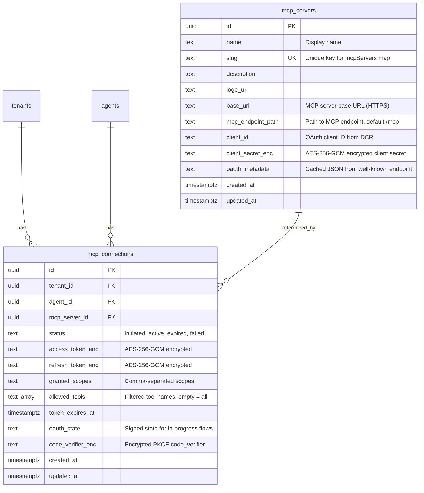

# feat: Custom MCP Server Registry

## Overview

Build a generic MCP server registry in AgentPlane that lets admins register external MCP servers (Herald, Pundit, future servers), tenants connect them to agents via OAuth 2.1 PKCE, and the sandbox runner passes them alongside Composio toolkits to Claude's `query()`.

## Problem Statement

AgentPlane only supports Composio toolkits as MCP tool sources. Herald (S3 file publishing, 5 tools) and Pundit (AI database querying, 7 tools) are custom MCP servers that tenants need. Composio cannot aggregate external MCP servers -- there is no API for registering external URLs. The platform needs first-class support for custom MCP servers.

## Proposed Solution

Two new database tables (`mcp_servers`, `mcp_connections`), a new OAuth 2.1 PKCE module, extended `buildMcpConfig()` and sandbox runner, and UI changes to the ConnectorsManager so custom MCP servers appear alongside Composio toolkits in the same dropdown.

## Technical Approach

### Architecture

```
Admin registers MCP server (name, base_url, logo)
  |
  v
AgentPlane discovers OAuth metadata (RFC 8414)
  |
  v
AgentPlane registers as OAuth client (RFC 7591 DCR)
  |
  v
mcp_servers row created (client_id, client_secret_enc)

Tenant connects MCP server to agent
  |
  v
OAuth 2.1 PKCE flow (authorize -> callback -> token exchange)
  |
  v
mcp_connections row created (agent_id, tokens encrypted)

Agent run starts
  |
  v
buildMcpConfig() loads mcp_connections, refreshes expired tokens
  |
  v
mcpServers map: { composio: {...}, herald: {...}, pundit: {...} }
  |
  v
Sandbox runner passes all servers to Claude query()
```

### Database Schema



### Key Design Decisions

1. **`mcp_servers` is global (not tenant-scoped)** -- Admin registers servers once, all tenants can connect. No RLS on this table -- read access is public, writes are admin-only.

2. **`mcp_connections` is per-agent** -- Each agent-server pair has its own OAuth connection. Unique constraint on `(agent_id, mcp_server_id)`. RLS enforced via `tenant_id`.

3. **Single callback URL per MCP server** -- Callback at `/api/mcp-servers/[mcpServerId]/callback`. The `agentId` and `tenantId` are conveyed via the signed state parameter, not the URL path. This allows one DCR `redirect_uri` registration per server.

4. **PKCE code_verifier stored in DB** -- During OAuth initiation, the `code_verifier` is stored encrypted in the `mcp_connections` row (status=`initiated`). On callback, it's read from the row, used for token exchange, then cleared. More reliable than cookies (works for API-only tenants too).

5. **Token refresh with row-level locking** -- `SELECT ... FOR UPDATE` on the `mcp_connections` row prevents race conditions when concurrent runs both detect an expired token.

6. **Pre-run buffer refresh** -- If `token_expires_at - now < 10 minutes` (sandbox timeout), force a token refresh before creating the sandbox. Prevents mid-run expiry.

7. **Sandbox network policy dynamically extended** -- Extract hostnames from connected MCP server `base_url`s and add them to `networkPolicy.allow` at sandbox creation time.

8. **SSRF prevention** -- Admin server registration validates `base_url` is HTTPS and does not resolve to private IP ranges.

---

## Implementation Phases

### Phase 1: Database + Admin API

Create the foundation: new tables and admin CRUD for MCP server registration.

**Migration `007_add_mcp_servers_and_connections.sql`:**

```sql
-- mcp_servers: admin-managed registry (global, no RLS)
CREATE TABLE mcp_servers (
  id              UUID PRIMARY KEY DEFAULT gen_random_uuid(),
  name            TEXT NOT NULL,
  slug            TEXT NOT NULL UNIQUE,
  description     TEXT NOT NULL DEFAULT '',
  logo_url        TEXT,
  base_url        TEXT NOT NULL,
  mcp_endpoint_path TEXT NOT NULL DEFAULT '/mcp',
  client_id       TEXT,
  client_secret_enc TEXT,
  oauth_metadata  JSONB,
  created_at      TIMESTAMPTZ NOT NULL DEFAULT now(),
  updated_at      TIMESTAMPTZ NOT NULL DEFAULT now()
);

GRANT SELECT ON mcp_servers TO app_user;

CREATE INDEX idx_mcp_servers_slug ON mcp_servers (slug);

-- mcp_connections: per-agent OAuth connections (tenant-scoped)
CREATE TABLE mcp_connections (
  id                UUID PRIMARY KEY DEFAULT gen_random_uuid(),
  tenant_id         UUID NOT NULL REFERENCES tenants(id) ON DELETE CASCADE,
  agent_id          UUID NOT NULL REFERENCES agents(id) ON DELETE CASCADE,
  mcp_server_id     UUID NOT NULL REFERENCES mcp_servers(id) ON DELETE CASCADE,
  status            TEXT NOT NULL DEFAULT 'initiated'
                    CHECK (status IN ('initiated', 'active', 'expired', 'failed')),
  access_token_enc  TEXT,
  refresh_token_enc TEXT,
  granted_scopes    TEXT,
  token_expires_at  TIMESTAMPTZ,
  oauth_state       TEXT,
  allowed_tools     TEXT[] NOT NULL DEFAULT '{}',
  code_verifier_enc TEXT,
  created_at        TIMESTAMPTZ NOT NULL DEFAULT now(),
  updated_at        TIMESTAMPTZ NOT NULL DEFAULT now(),
  UNIQUE (agent_id, mcp_server_id)
);

ALTER TABLE mcp_connections ENABLE ROW LEVEL SECURITY;
ALTER TABLE mcp_connections FORCE ROW LEVEL SECURITY;

CREATE POLICY tenant_isolation ON mcp_connections
  FOR ALL TO app_user
  USING (tenant_id = NULLIF(current_setting('app.current_tenant_id', true), '')::uuid)
  WITH CHECK (tenant_id = NULLIF(current_setting('app.current_tenant_id', true), '')::uuid);

GRANT SELECT, INSERT, UPDATE, DELETE ON mcp_connections TO app_user;

CREATE INDEX idx_mcp_connections_agent ON mcp_connections (agent_id);
CREATE INDEX idx_mcp_connections_server ON mcp_connections (mcp_server_id);
CREATE INDEX idx_mcp_connections_tenant ON mcp_connections (tenant_id);
```

**Validation schemas (`src/lib/validation.ts`):**

```typescript
// New schemas
export const McpServerRow = z.object({
  id: z.string().uuid(),
  name: z.string(),
  slug: z.string(),
  description: z.string(),
  logo_url: z.string().nullable(),
  base_url: z.string().url(),
  mcp_endpoint_path: z.string(),
  client_id: z.string().nullable(),
  oauth_metadata: z.record(z.unknown()).nullable(),
  created_at: z.coerce.date(),
  updated_at: z.coerce.date(),
});
// Note: client_secret_enc is never exposed

export const CreateMcpServerSchema = z.object({
  name: z.string().min(1).max(100),
  slug: z.string().min(1).max(50).regex(/^[a-z0-9-]+$/),
  description: z.string().max(500).default(''),
  logo_url: z.string().url().optional(),
  base_url: z.string().url().refine(url => url.startsWith('https://'), 'Must be HTTPS'),
  mcp_endpoint_path: z.string().default('/mcp'),
});

export const McpConnectionRow = z.object({
  id: z.string().uuid(),
  tenant_id: z.string().uuid(),
  agent_id: z.string().uuid(),
  mcp_server_id: z.string().uuid(),
  status: z.enum(['initiated', 'active', 'expired', 'failed']),
  granted_scopes: z.string().nullable(),
  token_expires_at: z.coerce.date().nullable(),
  created_at: z.coerce.date(),
  updated_at: z.coerce.date(),
});
// Note: tokens, oauth_state, code_verifier never exposed
```

**Admin API routes:**

| Method | Path | Description |
|--------|------|-------------|
| `GET` | `/api/admin/mcp-servers` | List all registered MCP servers |
| `POST` | `/api/admin/mcp-servers` | Register new MCP server (triggers discovery + DCR) |
| `GET` | `/api/admin/mcp-servers/:id` | Get server details |
| `PATCH` | `/api/admin/mcp-servers/:id` | Update server metadata (name, description, logo) |
| `DELETE` | `/api/admin/mcp-servers/:id` | Deregister server (cascades to all connections) |

**Files to create/modify:**

- `src/db/migrations/007_add_mcp_servers_and_connections.sql` (new)
- `src/lib/validation.ts` (add schemas)
- `src/app/api/admin/mcp-servers/route.ts` (new -- GET list, POST create)
- `src/app/api/admin/mcp-servers/[mcpServerId]/route.ts` (new -- GET, PATCH, DELETE)

---

### Phase 2: OAuth 2.1 PKCE Module

Build the core OAuth module that handles well-known discovery, Dynamic Client Registration, authorization, token exchange, and token refresh.

**New file: `src/lib/mcp-oauth.ts`**

Key functions:

```typescript
// Discover OAuth metadata from /.well-known/oauth-authorization-server
export async function discoverOAuthMetadata(baseUrl: string): Promise<OAuthMetadata>

// Register AgentPlane as OAuth client via RFC 7591
export async function registerClient(
  registrationEndpoint: string,
  redirectUri: string,
  metadata: ClientRegistrationMetadata
): Promise<{ clientId: string; clientSecret: string }>

// Full registration flow: discover + register + store
export async function registerMcpServer(
  baseUrl: string,
  callbackUrl: string
): Promise<{ clientId: string; clientSecretEnc: string; metadata: OAuthMetadata }>

// Initiate OAuth 2.1 PKCE authorization
export async function initiateOAuth(params: {
  mcpServerId: string;
  agentId: string;
  tenantId: string;
  callbackUrl: string;
}): Promise<{ redirectUrl: string }>

// Exchange authorization code for tokens
export async function exchangeCode(params: {
  mcpConnectionId: string;
  code: string;
  codeVerifier: string;
  tokenEndpoint: string;
  clientId: string;
  clientSecret: string;
  redirectUri: string;
}): Promise<{ accessToken: string; refreshToken: string; expiresAt: Date; scopes: string }>

// Refresh an expired access token (with row-level locking)
export async function refreshAccessToken(
  connectionId: string,
  tenantId: string
): Promise<{ accessToken: string; expiresAt: Date }>
```

**PKCE flow detail:**

1. `initiateOAuth()`:
   - Generate `code_verifier` (43-128 char random string)
   - Compute `code_challenge = base64url(sha256(code_verifier))`
   - Create `mcp_connections` row with status=`initiated`, encrypted `code_verifier`
   - Sign state token with `{ mcpServerId, agentId, tenantId, connectionId, exp }`
   - Build authorization URL with `response_type=code`, `code_challenge`, `code_challenge_method=S256`, `state`, `redirect_uri`, `scope`
   - Return redirect URL

2. `exchangeCode()` (called from callback):
   - POST to token endpoint with `grant_type=authorization_code`, `code`, `code_verifier`, `redirect_uri`, `client_id`, `client_secret`
   - Encrypt and store tokens in `mcp_connections` row
   - Update status to `active`, clear `code_verifier_enc` and `oauth_state`

3. `refreshAccessToken()`:
   - `withTenantTransaction()` with `SELECT ... FOR UPDATE` on the connection row
   - If token is still valid (refreshed by another concurrent caller), return existing token
   - POST to token endpoint with `grant_type=refresh_token`, `refresh_token`, `client_id`, `client_secret`
   - Encrypt and store new tokens (access + rotated refresh)
   - Update `token_expires_at`

**SSRF validation helper:**

```typescript
// Validate URL is HTTPS and does not resolve to private IP
export async function validatePublicUrl(url: string): Promise<void>
```

**OAuth state signing:**

Extend existing `src/lib/oauth-state.ts` or create a parallel `signMcpOAuthState()` / `verifyMcpOAuthState()` that includes `{ mcpServerId, agentId, tenantId, connectionId, exp }`.

**Files to create/modify:**

- `src/lib/mcp-oauth.ts` (new -- all OAuth logic)
- `src/lib/oauth-state.ts` (add MCP-specific state signing, or generalize existing)

---

### Phase 3: Agent Connection Routes + Callback

Add the routes for tenants to connect/disconnect MCP servers to agents, and the OAuth callback.

**API routes:**

| Method | Path | Auth | Description |
|--------|------|------|-------------|
| `GET` | `/api/mcp-servers` | Tenant | List available MCP servers (from registry) |
| `GET` | `/api/agents/:agentId/mcp-connections` | Tenant | List agent's MCP connections with status |
| `POST` | `/api/agents/:agentId/mcp-connections/:mcpServerId/initiate-oauth` | Tenant/Admin | Initiate OAuth flow, returns redirect URL |
| `GET` | `/api/mcp-servers/:mcpServerId/callback` | None (bypass) | OAuth callback -- verifies state, exchanges code |
| `DELETE` | `/api/agents/:agentId/mcp-connections/:mcpServerId` | Tenant/Admin | Disconnect (delete connection, optionally revoke token) |
| `GET` | `/api/agents/:agentId/mcp-connections/:mcpServerId/tools` | Tenant/Admin | List available tools from MCP server (calls `tools/list` via MCP) |
| `PATCH` | `/api/agents/:agentId/mcp-connections/:mcpServerId` | Tenant/Admin | Update allowed_tools filter |

**Admin routes (mirror):**

| Method | Path | Auth | Description |
|--------|------|------|-------------|
| `GET` | `/api/admin/agents/:agentId/mcp-connections` | Admin | List agent's MCP connections |
| `POST` | `/api/admin/agents/:agentId/mcp-connections/:mcpServerId/initiate-oauth` | Admin | Initiate OAuth flow |
| `DELETE` | `/api/admin/agents/:agentId/mcp-connections/:mcpServerId` | Admin | Disconnect |
| `GET` | `/api/admin/agents/:agentId/mcp-connections/:mcpServerId/tools` | Admin | List available tools |
| `PATCH` | `/api/admin/agents/:agentId/mcp-connections/:mcpServerId` | Admin | Update allowed_tools |

**Tool discovery endpoint detail (`GET .../tools`):**

Uses the connection's access token to call `tools/list` on the MCP server via JSON-RPC over Streamable HTTP:
```
POST {base_url}{mcp_endpoint_path}
Authorization: Bearer {access_token}
Content-Type: application/json

{"jsonrpc": "2.0", "id": 1, "method": "tools/list", "params": {}}
```
Returns the list of tools with name, description, and input schema. Cached briefly (5 min) to avoid hammering the MCP server on repeated UI opens.

**Callback route detail (`/api/mcp-servers/[mcpServerId]/callback`):**

1. Extract `code` and `state` from query params
2. Verify signed state → extract `{ agentId, tenantId, connectionId }`
3. Load `mcp_connections` row by `connectionId`
4. Decrypt `code_verifier_enc`
5. Load `mcp_servers` row, decrypt `client_secret_enc`
6. Load OAuth metadata for token endpoint
7. Call `exchangeCode()` with all params
8. If popup mode: return HTML with `postMessage({ type: 'agentplane_mcp_oauth_callback', success: true, mcpServerId, agentId })`
9. If redirect mode: redirect to `/admin/agents/${agentId}?mcp_connected=1`

**Middleware bypass** -- Add to `src/middleware.ts`:
```typescript
// Bypass auth for MCP OAuth callbacks
if (/^\/api\/mcp-servers\/[^/]+\/callback$/.test(pathname)) {
  return NextResponse.next();
}
```

**Files to create/modify:**

- `src/app/api/mcp-servers/route.ts` (new -- GET list for tenants)
- `src/app/api/agents/[agentId]/mcp-connections/route.ts` (new -- GET list)
- `src/app/api/agents/[agentId]/mcp-connections/[mcpServerId]/initiate-oauth/route.ts` (new)
- `src/app/api/agents/[agentId]/mcp-connections/[mcpServerId]/route.ts` (new -- DELETE)
- `src/app/api/mcp-servers/[mcpServerId]/callback/route.ts` (new)
- `src/app/api/admin/agents/[agentId]/mcp-connections/route.ts` (new -- GET list)
- `src/app/api/admin/agents/[agentId]/mcp-connections/[mcpServerId]/initiate-oauth/route.ts` (new)
- `src/app/api/admin/agents/[agentId]/mcp-connections/[mcpServerId]/route.ts` (new -- DELETE)
- `src/middleware.ts` (add callback bypass)

---

### Phase 4: Sandbox Integration

Extend `buildMcpConfig()` and the sandbox runner to support custom MCP servers alongside Composio.

**Update `src/lib/mcp.ts`:**

```typescript
export async function buildMcpConfig(
  agent: AgentInternal,
  tenantId: string,
): Promise<McpBuildResult> {
  const servers: Record<string, McpServerConfig> = {};
  const errors: string[] = [];

  // Existing: Composio MCP server
  if (agent.composio_toolkits.length > 0) {
    // ... existing Composio logic (unchanged)
    servers.composio = { type: "http", url, headers };
  }

  // NEW: Custom MCP servers
  const connections = await getActiveConnections(agent.id, tenantId);
  for (const conn of connections) {
    try {
      const token = await getOrRefreshToken(conn, tenantId);
      const server = await getMcpServer(conn.mcp_server_id);
      const mcpUrl = `${server.base_url}${server.mcp_endpoint_path}`;
      servers[server.slug] = {
        type: "http",
        url: mcpUrl,
        headers: { Authorization: `Bearer ${token}` },
      };
    } catch (err) {
      errors.push(`MCP server ${conn.mcp_server_id}: ${err.message}`);
      logger.warn("Failed to configure custom MCP server", { connectionId: conn.id, error: err });
    }
  }

  return { servers, errors };
}
```

`getOrRefreshToken()` implements the pre-run buffer refresh:
```typescript
async function getOrRefreshToken(conn: McpConnection, tenantId: string): Promise<string> {
  const SANDBOX_TIMEOUT_MS = 10 * 60 * 1000; // 10 minutes
  const bufferMs = SANDBOX_TIMEOUT_MS + 60_000; // 11 min buffer
  const expiresAt = conn.token_expires_at?.getTime() ?? 0;

  if (expiresAt - Date.now() > bufferMs) {
    // Token has enough runway -- use as-is
    return decrypt(JSON.parse(conn.access_token_enc), ...);
  }

  // Token expires within sandbox window -- refresh
  return refreshAccessToken(conn.id, tenantId);
}
```

**Update `src/lib/sandbox.ts`:**

1. Extend `SandboxConfig` with `customMcpServers`:
```typescript
interface SandboxConfig {
  // ... existing fields
  customMcpServers?: Record<string, { url: string; headers: Record<string, string> }>;
}
```

2. Dynamic network policy -- extract hostnames from custom MCP server URLs and add to allowlist:
```typescript
const customHosts = Object.values(config.customMcpServers ?? {})
  .map(s => new URL(s.url).hostname);

networkPolicy: {
  allow: [
    "ai-gateway.vercel.sh",
    "*.composio.dev",
    "*.firecrawl.dev",
    "*.githubusercontent.com",
    "registry.npmjs.org",
    new URL(config.platformApiUrl).hostname,
    ...customHosts,
  ],
},
```

3. Pass custom MCP servers as a single JSON env var:
```typescript
if (config.customMcpServers && Object.keys(config.customMcpServers).length > 0) {
  env.CUSTOM_MCP_SERVERS = JSON.stringify(config.customMcpServers);
}
```

4. Update `buildRunnerScript()` to reconstruct custom MCP servers:
```javascript
// Custom MCP servers
if (process.env.CUSTOM_MCP_SERVERS) {
  const customs = JSON.parse(process.env.CUSTOM_MCP_SERVERS);
  for (const [name, config] of Object.entries(customs)) {
    mcpServers[name] = { type: 'http', url: config.url, headers: config.headers };
  }
}
```

5. **Tool filtering via `allowedTools`** -- MCP tools are named `mcp__<server_slug>__<tool_name>` by Claude. When a connection has `allowed_tools` set (non-empty), compute the full `allowedTools` list:

```typescript
// In buildMcpConfig or sandbox config builder
const mcpAllowedTools: string[] = [];
for (const conn of connections) {
  if (conn.allowed_tools.length > 0) {
    const server = await getMcpServer(conn.mcp_server_id);
    for (const tool of conn.allowed_tools) {
      mcpAllowedTools.push(`mcp__${server.slug}__${tool}`);
    }
  }
}
// Pass to sandbox config -- runner sets allowedTools only if non-empty
```

In the runner script, if `CUSTOM_MCP_ALLOWED_TOOLS` is set, include it in the query options:
```javascript
const customAllowedTools = process.env.CUSTOM_MCP_ALLOWED_TOOLS
  ? JSON.parse(process.env.CUSTOM_MCP_ALLOWED_TOOLS)
  : [];
// Merge with agent's own allowedTools if any
if (customAllowedTools.length > 0) {
  options.allowedTools = [...(options.allowedTools || []), ...customAllowedTools];
}
```

**Note:** When ALL connected MCP servers have empty `allowed_tools` (no filtering), `allowedTools` is omitted entirely so all MCP tools are available. When ANY connection has filtering, only the explicitly allowed tools from that server are included. Unfiltered servers have all their tools included by omitting them from the filter (or by discovering their full tool list and including all names).

**Update run creation routes** to pass custom MCP servers to sandbox config. Both `src/app/api/runs/route.ts` and `src/app/api/admin/agents/[agentId]/runs/route.ts` already call `buildMcpConfig()` -- extend them to pass `mcpResult.servers` (minus `composio`) as `customMcpServers`.

**Run-time error surfacing for expired/failed connections:**

When `buildMcpConfig()` catches a failed token refresh (permanent refresh token expiry), it:
1. Sets the connection status to `failed` in the DB
2. Includes the error in `McpBuildResult.errors` (e.g., `"Herald: refresh token expired, reconnect required"`)
3. The run creation route includes these errors in the `run_started` SSE event's `warnings` field

This ensures the admin sees connection failures in the run output without needing to check the agent detail page. The run still proceeds with whatever MCP servers are available — degraded but not blocked.

```typescript
// In buildMcpConfig(), inside the catch block for each connection:
} catch (err) {
  const msg = err instanceof Error ? err.message : String(err);
  errors.push(`${server.slug}: ${msg}`);
  // Mark connection as failed so dashboard shows the warning
  await markConnectionFailed(conn.id, tenantId);
  logger.warn("MCP connection failed during run setup", {
    connectionId: conn.id, serverId: conn.mcp_server_id, error: msg,
  });
}
```

**Files to modify:**

- `src/lib/mcp.ts` (extend `buildMcpConfig()`)
- `src/lib/mcp-connections.ts` (new -- `markConnectionFailed()`)
- `src/lib/sandbox.ts` (extend `SandboxConfig`, network policy, runner script, env vars)
- `src/app/api/runs/route.ts` (pass custom MCP servers + warnings to sandbox)
- `src/app/api/admin/agents/[agentId]/runs/route.ts` (same)

---

### Phase 5: Admin UI

Extend the ConnectorsManager to show custom MCP servers at the top of the "Add" dropdown, with identical UX to Composio toolkits.

**Extend `ConnectorsManager` (`src/app/admin/(dashboard)/agents/[agentId]/connectors-manager.tsx`):**

1. Fetch MCP connections alongside Composio connectors on load:
   ```typescript
   const [composioConnectors, setComposioConnectors] = useState<ConnectorStatus[]>([]);
   const [mcpConnections, setMcpConnections] = useState<McpConnectionStatus[]>([]);
   ```

2. Render custom MCP connection cards above Composio connector cards in the same grid. Same card layout: logo + name + status badge + disconnect button.

3. Custom MCP connector status mapping:
   - `active` → green "Connected"
   - `initiated` → yellow "Pending"
   - `expired` → orange "Expired" + "Reconnect" button
   - `failed` → red "Failed" + "Reconnect" button

4. "Reconnect" triggers a new OAuth flow (creates new `mcp_connections` row or reuses existing).

5. **Tool filtering** -- Each custom MCP connection card shows a tool count (clickable). Clicking opens a `McpToolsModal` (modeled after the existing `ToolsModal` for Composio). The modal:
   - Fetches available tools from `GET /api/admin/agents/:agentId/mcp-connections/:mcpServerId/tools`
   - Displays tool name + description with checkboxes
   - "Select All" / "Clear All" toggles
   - On save, PATCHes the connection with `{ allowed_tools: [...] }`
   - Empty `allowed_tools` = all tools allowed (no filtering)

**Extend toolkit dropdown (`src/components/toolkit-multiselect.tsx` or new wrapper):**

The dropdown needs to show two sections:
1. **Custom MCP Servers** (fetched from `GET /api/admin/mcp-servers`) -- at top with section header
2. **Composio Toolkits** (existing, fetched from `GET /api/admin/composio/toolkits`) -- below

Approach: extend `ToolkitMultiselect` to accept an additional `mcpServers` prop, or create a merged `ConnectorMultiselect` component.

When a custom MCP server is selected and "Apply" is clicked:
- Instead of PATCHing `composio_toolkits`, initiate the OAuth flow for that MCP server via `POST /api/admin/agents/:agentId/mcp-connections/:mcpServerId/initiate-oauth`
- Open popup or redirect for OAuth

**Agent list page — connection health indicator (`/admin/agents`):**

The agent list page (`src/app/admin/(dashboard)/agents/page.tsx`) shows a warning badge on agents that have MCP connections in `expired` or `failed` state. This gives admins immediate visibility without clicking into each agent.

Implementation:
1. Extend the agents list API (`GET /api/admin/agents`) to include an `mcp_connection_issues` count per agent via a LEFT JOIN subquery:
   ```sql
   SELECT a.*, COALESCE(mc.issue_count, 0) AS mcp_connection_issues
   FROM agents a
   LEFT JOIN (
     SELECT agent_id, COUNT(*) AS issue_count
     FROM mcp_connections
     WHERE status IN ('expired', 'failed')
     GROUP BY agent_id
   ) mc ON mc.agent_id = a.id
   ```
2. In the agent list row, when `mcp_connection_issues > 0`, render an orange warning icon with tooltip: `"N MCP connection(s) need attention"`.
3. Clicking the warning icon navigates to the agent's Connectors tab.

**Files to modify:**
- `src/app/api/admin/agents/route.ts` (extend GET query with subquery)
- `src/app/admin/(dashboard)/agents/page.tsx` (render warning badge)

**Admin MCP server management page (`/admin/mcp-servers`):**

New page at `src/app/admin/(dashboard)/mcp-servers/page.tsx`:
- List all registered MCP servers with name, slug, base_url, connection count
- "Register" button opens a form (name, slug, description, base_url, logo_url)
- On submit: POST to `/api/admin/mcp-servers`
- Multi-step feedback: "Discovering OAuth configuration..." → "Registering client..." → "Done"
- Edit/delete actions per server

**Agent detail page (`src/app/admin/(dashboard)/agents/[agentId]/page.tsx`):**

Add `<ConnectorsManager>` props for MCP connections:
```tsx
<ConnectorsManager
  agentId={agent.id}
  toolkits={agent.composio_toolkits}
  composioAllowedTools={agent.composio_allowed_tools}
  mcpConnections={mcpConnections}  // NEW
/>
```

**Files to create/modify:**

- `src/app/admin/(dashboard)/mcp-servers/page.tsx` (new -- server management)
- `src/app/admin/(dashboard)/agents/[agentId]/page.tsx` (pass MCP connections to ConnectorsManager)
- `src/app/admin/(dashboard)/agents/[agentId]/connectors-manager.tsx` (extend for MCP)
- `src/components/toolkit-multiselect.tsx` (add MCP server section to dropdown)

---

## Acceptance Criteria

### Functional Requirements

- [ ] Admin can register an MCP server by providing name, slug, base_url, and logo_url
- [ ] Registration auto-discovers OAuth metadata from `/.well-known/oauth-authorization-server`
- [ ] Registration auto-registers AgentPlane as OAuth client via RFC 7591 DCR
- [ ] Custom MCP servers appear at the top of the Connectors "Add" dropdown on the agent detail page
- [ ] Tenant/admin can connect an MCP server to an agent via OAuth 2.1 PKCE
- [ ] OAuth callback exchanges code for tokens, stores encrypted tokens in DB
- [ ] Agent runs include connected custom MCP servers in the `mcpServers` map
- [ ] Expired tokens are refreshed on-demand before sandbox creation
- [ ] Pre-run buffer refresh triggers when token expires within 11 minutes
- [ ] Concurrent token refresh is serialized via row-level locking
- [ ] Tenant/admin can disconnect an MCP server from an agent
- [ ] Custom MCP server connection status is displayed identically to Composio connector status
- [ ] Tenant/admin can browse available tools from a connected MCP server (calls `tools/list` via MCP)
- [ ] Tenant/admin can select which tools are allowed per connection (same UX as Composio's ToolsModal)
- [ ] When `allowed_tools` is set, only those tools are available to Claude during runs
- [ ] When `allowed_tools` is empty, all tools from the MCP server are available
- [ ] Admin can list, edit, and delete registered MCP servers
- [ ] Deleting an MCP server cascades to all connections
- [ ] When a token refresh fails during run setup, the error appears in the `run_started` SSE event warnings and the connection is marked `failed`
- [ ] Agent list page shows a warning badge when an agent has `expired` or `failed` MCP connections
- [ ] Clicking the warning badge navigates to the agent's Connectors tab

### Non-Functional Requirements

- [ ] SSRF prevention: base_url validated as HTTPS, no private IPs
- [ ] Tokens encrypted at rest with AES-256-GCM (supports key rotation via `ENCRYPTION_KEY_PREVIOUS`)
- [ ] `mcp_connections` has RLS enforcing tenant isolation
- [ ] Sandbox network policy dynamically includes custom MCP server hostnames
- [ ] Bearer tokens never logged or included in URLs
- [ ] OAuth callback route bypasses auth middleware

### Quality Gates

- [ ] Migration runs cleanly against Neon (test with `npm run migrate`)
- [ ] `npx next build` passes (type-check + build)
- [ ] Unit tests for `mcp-oauth.ts` (discovery, DCR, token exchange, refresh, SSRF validation)
- [ ] Manual end-to-end test: register Herald → connect to agent → run agent → verify Herald tools available

---

## Risk Analysis & Mitigation

| Risk | Impact | Mitigation |
|------|--------|------------|
| MCP server's `.well-known` endpoint unreachable or malformed | Admin can't register server | Validate and show clear error during registration |
| DCR rejected (server requires initial access token) | Can't register client | Surface error, allow manual client_id/secret entry as fallback |
| Token expires mid-run (short-lived tokens) | MCP tools fail inside sandbox | Pre-run buffer refresh (11-minute window) |
| Concurrent refresh race condition | Double refresh, one fails | `SELECT ... FOR UPDATE` row lock |
| Refresh token permanently expired | Connection unusable | Mark status=`failed`, show "Reconnect" in UI |
| MCP server goes down during run | Tool calls fail | Graceful degradation -- Claude reports tool errors, run continues |
| SSRF via admin-provided base_url | Internal network exposure | URL validation (HTTPS only, no private IPs) |

---

## Dependencies & Prerequisites

- Existing `ENCRYPTION_KEY` env var (already deployed)
- Existing `oauth-state.ts` signing module (reusable pattern)
- Herald and Pundit must expose `/.well-known/oauth-authorization-server` metadata endpoint
- Herald and Pundit must support RFC 7591 Dynamic Client Registration
- Herald and Pundit must accept OAuth 2.1 PKCE authorization code flow

---

## Review Amendments (2026-02-18)

Based on parallel reviews from 5 specialist agents (security, architecture, data integrity, performance, TypeScript), the following amendments are incorporated into this plan. Changes are grouped by phase.

### Cross-Cutting Amendments

#### A1. Branded Types (TypeScript — Critical)

Add to `src/lib/types.ts`:

```typescript
export type McpServerId = string & { readonly __brand: "McpServerId" };
export type McpConnectionId = string & { readonly __brand: "McpConnectionId" };
```

All function signatures in `mcp-oauth.ts`, `mcp-connections.ts`, and route handlers must use branded types (`McpServerId`, `McpConnectionId`, `AgentId`, `TenantId`) — never plain `string`. Zod schemas must use `.transform()` to cast IDs to branded types, matching the existing `AgentInternal` pattern.

#### A2. Define Missing Type Interfaces (TypeScript — Medium)

Add `OAuthMetadata` interface (used by discovery + token exchange):

```typescript
export interface OAuthMetadata {
  issuer: string;
  authorization_endpoint: string;
  token_endpoint: string;
  registration_endpoint?: string;
  scopes_supported?: string[];
  response_types_supported: string[];
  grant_types_supported?: string[];
  code_challenge_methods_supported?: string[];
}
```

Add `ClientRegistrationMetadata`, `TokenExchangeResult`, and `UpdateMcpConnectionSchema` — all referenced in the plan but not defined.

#### A3. Module Split: `mcp-oauth.ts` → Two Files (Architecture — Medium)

Split into:
- `src/lib/mcp-oauth.ts` — pure HTTP functions: `discoverOAuthMetadata()`, `registerClient()`, `exchangeCodeForTokens()`, `callTokenRefreshEndpoint()`. No DB access. Independently testable.
- `src/lib/mcp-connections.ts` — DB-aware orchestration: `initiateOAuth()`, `completeOAuth()`, `getOrRefreshToken()`, `getActiveConnections()`. Uses `mcp-oauth.ts` for HTTP, `db` for persistence.

This mirrors how `composio.ts` (external API) is separate from `mcp.ts` (MCP config orchestration).

#### A4. OAuth State Signing: Separate File (Architecture — Medium)

Create `src/lib/mcp-oauth-state.ts` with `signMcpOAuthState()` / `verifyMcpOAuthState()` using the MCP-specific payload `{ mcpServerId, agentId, tenantId, connectionId, exp }`. Do NOT modify existing `oauth-state.ts` to avoid breaking the Composio callback flow.

---

### Phase 1 Amendments: Database + Admin API

#### P1.1. Migration Idempotency (Data — High)

Use `CREATE TABLE IF NOT EXISTS` and `CREATE INDEX IF NOT EXISTS` on all DDL statements, matching the convention in `001_initial.sql`.

#### P1.2. `updated_at` Trigger (Data — High)

Add a shared trigger function + per-table triggers:

```sql
CREATE OR REPLACE FUNCTION set_updated_at()
RETURNS TRIGGER LANGUAGE plpgsql AS $$
BEGIN
  NEW.updated_at = now();
  RETURN NEW;
END;
$$;

CREATE TRIGGER mcp_servers_updated_at
  BEFORE UPDATE ON mcp_servers FOR EACH ROW EXECUTE FUNCTION set_updated_at();
CREATE TRIGGER mcp_connections_updated_at
  BEFORE UPDATE ON mcp_connections FOR EACH ROW EXECUTE FUNCTION set_updated_at();
```

#### P1.3. CHECK Constraints on Status-Dependent Fields (Data — Medium)

```sql
CONSTRAINT active_requires_tokens CHECK (
  status != 'active' OR (access_token_enc IS NOT NULL AND token_expires_at IS NOT NULL)
),
CONSTRAINT initiated_requires_verifier CHECK (
  status != 'initiated' OR (code_verifier_enc IS NOT NULL AND oauth_state IS NOT NULL)
)
```

#### P1.4. GRANTs: Full DML for `app_user` (Data — High)

Grant `SELECT, INSERT, UPDATE, DELETE ON mcp_servers TO app_user` (not SELECT-only). Admin-only writes are enforced at the application layer via `ADMIN_API_KEY`, not at the DB role level. This matches how all other tables work with the `ALTER DEFAULT PRIVILEGES` from migration 001.

#### P1.5. `granted_scopes` as `TEXT[]` (Data — Low)

Change from comma-separated `TEXT` to `TEXT[] NOT NULL DEFAULT '{}'`, matching the pattern used by `allowed_tools` and `composio_allowed_tools`.

#### P1.6. Improved Indexes (Performance/Data — Medium)

Replace the three single-column indexes with:

```sql
-- Partial index for the hot buildMcpConfig() read
CREATE INDEX IF NOT EXISTS idx_mcp_connections_agent_active
  ON mcp_connections (agent_id) WHERE status = 'active';

-- Keep tenant index for tenant-scoped queries
CREATE INDEX IF NOT EXISTS idx_mcp_connections_tenant
  ON mcp_connections (tenant_id);

-- Server index for cascade lookups
CREATE INDEX IF NOT EXISTS idx_mcp_connections_server
  ON mcp_connections (mcp_server_id);
```

#### P1.7. Admin DELETE Guard (Data — Medium)

The `DELETE /api/admin/mcp-servers/:id` handler must check for active connections and return `409 Conflict` if any exist. Do not rely solely on `ON DELETE CASCADE` for destructive mass deletion.

#### P1.8. Reserved Slug Validation (TypeScript — Low)

Add `.refine(s => s !== 'composio', { message: 'slug "composio" is reserved' })` to `CreateMcpServerSchema.slug`. The slug is used as a key in the `mcpServers` map — `"composio"` would collide with the existing Composio entry.

#### P1.9. `mcp_endpoint_path` Validation (Security — Medium)

```typescript
mcp_endpoint_path: z
  .string()
  .max(200)
  .regex(/^\/[a-zA-Z0-9/_-]*$/, 'Must be an absolute path')
  .default('/mcp'),
```

Use `new URL(server.mcp_endpoint_path, server.base_url).toString()` for URL construction instead of string concatenation.

#### P1.10. Add `mcp_endpoint_path` to `McpServerRow` Schema (TypeScript — High)

The schema currently omits `mcp_endpoint_path` even though Phase 4 code reads `server.mcp_endpoint_path`. Add it:

```typescript
mcp_endpoint_path: z.string().default('/mcp'),
```

#### P1.11. Migration Numbering Coordination (Architecture — High)

If the admin email/password login plan also needs a migration, coordinate numbering before implementation to avoid a `007` conflict.

---

### Phase 2 Amendments: OAuth 2.1 PKCE Module

#### P2.1. SSRF Prevention: Per-Request IP Validation (Security — Critical)

Registration-time-only SSRF checks are vulnerable to **DNS rebinding**. An attacker registers a public IP, then switches DNS to `169.254.169.254`.

**Fix:** Validate resolved IP against private/reserved ranges at every outbound HTTP call (discovery, DCR, token exchange, `tools/list`). Implement a `safeFetch()` wrapper that resolves the hostname, checks the IP, then connects. This is the primary control; sandbox network policy is defense-in-depth.

#### P2.2. Validate `oauth_metadata` URLs Against SSRF (Security — High)

After fetching `oauth_metadata`, validate that `token_endpoint`, `authorization_endpoint`, and all other URL fields:
1. Pass the same SSRF IP check as `base_url`
2. Share the same origin (scheme + host) as `base_url`, or are on an explicit allowlist

Use a strict `OAuthMetadata` Zod schema (not `z.record(z.unknown())`) when parsing metadata from the DB.

#### P2.3. Token Refresh: Release Transaction Before HTTP Call (Performance — High)

Restructure `refreshAccessToken()` to a two-phase pattern:

1. **Phase A (short transaction):** `SELECT ... FOR UPDATE NOWAIT` on the connection row. If token is still valid (another caller refreshed), return it and commit. If still expired, mark `refresh_in_progress`, commit.
2. **HTTP call** (outside any transaction): POST to token endpoint.
3. **Phase B (short transaction):** UPDATE with new tokens.

Use `NOWAIT` to prevent indefinite blocking — if another caller holds the lock, retry once after a short delay.

#### P2.4. `McpConnectionRowInternal` Schema (TypeScript — High)

Split into public and internal schemas (matching `AgentRow`/`AgentRowInternal` pattern):

```typescript
export const McpConnectionRow = z.object({
  id: z.string().uuid(),
  tenant_id: z.string().uuid(),
  agent_id: z.string().uuid(),
  mcp_server_id: z.string().uuid(),
  status: z.enum(['initiated', 'active', 'expired', 'failed']),
  granted_scopes: z.array(z.string()),
  allowed_tools: z.array(z.string()).default([]),
  token_expires_at: z.coerce.date().nullable(),
  created_at: z.coerce.date(),
  updated_at: z.coerce.date(),
});

export const McpConnectionRowInternal = McpConnectionRow.extend({
  access_token_enc: z.string().nullable(),
  refresh_token_enc: z.string().nullable(),
  code_verifier_enc: z.string().nullable(),
});
```

#### P2.5. `exchangeCode()` Return Type (TypeScript — Medium)

```typescript
export interface TokenExchangeResult {
  accessToken: string;
  refreshToken: string | null; // not all servers issue refresh tokens
  expiresAt: Date;
  scopes: string;
}
```

#### P2.6. Error Narrowing in Catch Blocks (TypeScript — High)

All `catch (err)` blocks must narrow the error type:

```typescript
const msg = err instanceof Error ? err.message : String(err);
```

This is required in TypeScript strict mode (which Next.js uses).

---

### Phase 3 Amendments: Routes + Callback

#### P3.1. Callback Replay Prevention (Security — Critical)

The callback handler must:
1. After verifying the signed state, load the `mcp_connections` row and confirm `status === 'initiated'`. If not `initiated`, reject immediately.
2. Use `withTenantTransaction(tenantId)` (extracted from verified state) for all DB queries — ensures RLS is enforced even though HTTP auth is bypassed.
3. Rate-limit the callback endpoint by IP.

#### P3.2. Stale `initiated` Rows: UPSERT Pattern (Data — Medium)

In `POST .../initiate-oauth`, use UPSERT to handle reconnection:

```sql
INSERT INTO mcp_connections (agent_id, mcp_server_id, tenant_id, status, code_verifier_enc, oauth_state)
VALUES ($1, $2, $3, 'initiated', $4, $5)
ON CONFLICT (agent_id, mcp_server_id)
DO UPDATE SET
  status = 'initiated',
  code_verifier_enc = EXCLUDED.code_verifier_enc,
  oauth_state = EXCLUDED.oauth_state
WHERE mcp_connections.status IN ('initiated', 'expired', 'failed');
```

The `WHERE` clause prevents overwriting an `active` connection.

#### P3.3. OAuth Initiation Rate Limiting (Security — Medium)

Add rate limiting on `initiate-oauth` keyed by `tenantId`. Before creating a new `initiated` row, check if one was created within the last 30 seconds and return the existing redirect URL (idempotency pattern).

#### P3.4. Tool Discovery Caching Decision (Architecture — Medium)

Use in-memory process cache with 5-min TTL for `tools/list` results. Do not add Vercel KV dependency for a UI convenience feature. Add in-flight request deduplication via a `Map<connectionId, Promise>`.

---

### Phase 4 Amendments: Sandbox Integration

#### P4.1. Token Passing: Avoid Env Var Leak (Security — High)

Do NOT pass decrypted bearer tokens in `CUSTOM_MCP_SERVERS` env var. Instead, pass each token as a separate named env var (e.g., `MCP_TOKEN_HERALD`) consumed once in the runner script and then deleted:

```javascript
// In runner script
const token = process.env.MCP_TOKEN_HERALD;
delete process.env.MCP_TOKEN_HERALD;
mcpServers.herald = { type: 'http', url: '...', headers: { Authorization: `Bearer ${token}` } };
```

#### P4.2. Parallelize `buildMcpConfig()` (Performance — High)

Replace sequential loop with:

```typescript
// Batch-fetch all server records in one query
const serverIds = connections.map(c => c.mcp_server_id);
const servers = await getMcpServersByIds(serverIds); // WHERE id = ANY($1)
const serverMap = new Map(servers.map(s => [s.id, s]));

// Parallelize token operations
const results = await Promise.allSettled(
  connections.map(async (conn) => {
    const server = serverMap.get(conn.mcp_server_id)!;
    const token = await getOrRefreshToken(conn, tenantId);
    return { server, token };
  })
);
```

#### P4.3. `McpBuildResult` Typed Split (Architecture — High)

```typescript
export interface McpBuildResult {
  composioServer?: McpServerConfig;
  customServers: Record<string, McpServerConfig>;
  errors: string[];
}
```

Callers use `mcpResult.composioServer` and `mcpResult.customServers` directly — no key-name inspection.

#### P4.4. Update `hasMcp` Guard (Architecture — Critical)

The existing guard in `buildRunnerScript()`:

```typescript
const hasMcp = !!config.composioMcpUrl;
```

Must become:

```typescript
const hasMcp = !!config.composioMcpUrl || Object.keys(config.customMcpServers ?? {}).length > 0;
```

Without this, agents using only custom MCP servers (no Composio) will have `allowedTools` incorrectly applied, blocking all `mcp__*` tool calls.

#### P4.5. Cache `mcp_servers` Records (Performance — Medium)

Add process-level `Map` cache with 5-min TTL for `getMcpServer()`. The `mcp_servers` table is admin-managed with low churn — cache invalidation is trivial. Eliminates a DB round-trip from every `buildMcpConfig()` and token refresh.

#### P4.6. Increase Pool Max (Performance — Low)

Increase `max` from 5 to 10 in `src/db/index.ts` before this feature ships. Token refresh transactions now hold connections during network I/O.

---

### Updated Risk Matrix

| Risk | Severity | Likelihood | Mitigation |
|------|----------|------------|------------|
| DNS rebinding bypasses SSRF validation | Critical | Medium | Per-request IP validation via `safeFetch()` wrapper |
| Callback state replay / missing status check | Critical | Medium | Verify `status === 'initiated'`, rate-limit callback by IP |
| `hasMcp` guard not updated for custom servers | Critical | High | Update guard to include custom MCP servers |
| Stored SSRF via `oauth_metadata` URLs | High | Medium | Validate all URLs in metadata against SSRF + same-origin check |
| Bearer tokens in sandbox env vars | High | Medium | Per-token env vars, delete after consumption |
| Callback RLS context gap | High | Low | Use `withTenantTransaction(tenantId)` from verified state |
| Sequential `buildMcpConfig()` latency | High | High | `Promise.allSettled()` + batch server fetch |
| Token refresh holds DB pool connection | High | Medium | Two-phase transaction pattern, `FOR UPDATE NOWAIT` |
| Pool exhaustion under concurrency | Medium | Medium | Increase pool max from 5 to 10 |
| Stale `initiated` rows block reconnection | Medium | Medium | UPSERT with status guard |
| Admin accidental server deletion | Medium | Low | 409 Conflict guard in DELETE handler |
| `logo_url` leaks admin IP | Medium | Low | Validate image extensions or proxy via Vercel Blob |
| Migration numbering conflict with login plan | Medium | Medium | Coordinate before implementation |

---

### Additional Quality Gates

- [ ] `safeFetch()` wrapper unit tests: SSRF validation rejects private IPs, DNS rebinding defense
- [ ] Callback handler rejects replayed state tokens (status !== 'initiated')
- [ ] Callback handler uses `withTenantTransaction()` for RLS enforcement
- [ ] `hasMcp` guard includes custom MCP servers (verified via test with Composio-free agent)
- [ ] Token refresh `FOR UPDATE NOWAIT` releases connection before HTTP call
- [ ] `buildMcpConfig()` parallelization: verify with 3+ custom servers
- [ ] Bearer tokens not present in sandbox environment after runner script initialization

---

## References & Research

### Internal References

- Brainstorm: `docs/brainstorms/2026-02-18-composio-custom-mcps-brainstorm.md`
- Composio connector flow: `src/app/admin/(dashboard)/agents/[agentId]/connectors-manager.tsx`
- OAuth state signing: `src/lib/oauth-state.ts`
- Encryption: `src/lib/crypto.ts:69-115`
- MCP config builder: `src/lib/mcp.ts:19-82`
- Sandbox runner: `src/lib/sandbox.ts:174-287`
- Network policy: `src/lib/sandbox.ts:59-67`
- Migration conventions: `src/db/migrations/001_initial.sql:126-155` (RLS pattern)
- Middleware bypass: `src/middleware.ts:55` (callback regex)

### External References

- RFC 8414: OAuth 2.0 Authorization Server Metadata
- RFC 7591: OAuth 2.0 Dynamic Client Registration
- RFC 7636: PKCE for OAuth 2.0
- MCP Specification: Streamable HTTP transport
