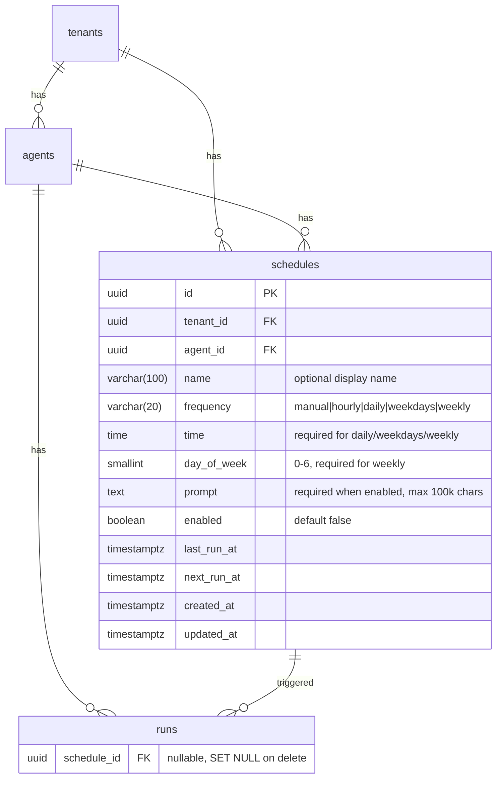

# feat: Multiple Agent Schedules

## Enhancement Summary

**Deepened on:** 2026-03-08
**Agents used:** TypeScript reviewer, Performance oracle, Data migration expert, Security sentinel, Architecture strategist, Data integrity guardian, Pattern recognition specialist, Deployment verification, Frontend races reviewer, Best practices researcher

### Key Improvements
1. **Executor security**: Only pass `schedule_id` to executor — load all data from DB, never trust POST body
2. **Bidirectional CHECK constraint**: `(triggered_by = 'schedule' AND schedule_id IS NOT NULL) OR (triggered_by != 'schedule' AND schedule_id IS NULL)`
3. **Claim fairness**: `DISTINCT ON (agent_id)` prevents one agent's many schedules from starving others
4. **Migration hardening**: `NOT VALID` + `VALIDATE CONSTRAINT` for runs CHECK, explicit `GRANT TO app_user`, edge case handling for empty prompts
5. **Frontend race prevention**: Per-schedule operation state machine, generation counter for re-fetching, no optimistic updates
6. **Composite FK on runs**: `(schedule_id, tenant_id)` for cross-tenant safety, matching existing `fk_runs_agent_tenant` pattern

### New Considerations Discovered
- `UpdateScheduleSchema` must be built explicitly (not `.partial()` on a `.superRefine()` schema)
- Use scalar subqueries for schedule counts on agent list page (avoid JOIN row multiplication)
- Composite partial index `(agent_id, next_run_at) WHERE enabled = true` supports both fairness dedup and cron claiming
- Wrap claim + recompute in a single transaction to reduce stuck-job window
- Disable cron before deploying, re-enable after verification

---

## Overview

Move from a single schedule per agent (7 flat columns on `agents`) to a dedicated `schedules` table supporting an arbitrary number of independent schedules per agent. Each schedule has its own name, frequency, prompt, enabled toggle, and run tracking.

## Problem Statement / Motivation

Agents often need to run on multiple different schedules with different prompts. For example, an agent might need to run a "morning digest" daily at 9am and a "weekly summary" every Monday. Currently, agents are limited to a single schedule, forcing users to create duplicate agents to achieve this.

## Proposed Solution

Create a dedicated `schedules` table with FK to `agents`. Each schedule row is independently configurable and claimable by the cron dispatcher. The admin UI shows a list of schedule cards with add/edit/delete. Runs link back to the triggering schedule via `schedule_id`.

(see brainstorm: docs/brainstorms/2026-03-08-multiple-agent-schedules-brainstorm.md)

## Technical Approach

### Database Schema



### Migration: `src/db/migrations/013_schedules_table.sql`

Single migration that:

1. **Creates `schedules` table** with:
   - UUID PK (`DEFAULT gen_random_uuid()`), `tenant_id` + `agent_id` FKs (both `ON DELETE CASCADE`)
   - Composite FK `(agent_id, tenant_id) REFERENCES agents(id, tenant_id)` for cross-tenant safety (matches `runs` pattern)
   - `UNIQUE(id, tenant_id)` constraint (required for composite FK from `runs`)
   - Same CHECK constraints as current agent columns: `chk_schedule_time_required`, `chk_schedule_day_of_week_weekly`, `chk_schedule_prompt_required` (with `length(prompt) > 0`), `chk_schedule_enabled_not_manual`
   - RLS with `tenant_isolation` policy: `ENABLE` + `FORCE` + fail-closed `NULLIF` pattern
   - Explicit `GRANT SELECT, INSERT, UPDATE, DELETE ON schedules TO app_user`
   - `set_updated_at()` trigger (verify function exists; add `CREATE OR REPLACE FUNCTION` if needed)
   - Composite partial index: `idx_schedules_due ON schedules(agent_id, next_run_at) WHERE enabled = true`
   - Index: `idx_schedules_agent ON schedules(agent_id)` for listing

2. **Copies existing schedule data** from `agents` to `schedules` — only agents with `schedule_frequency != 'manual'`. Generates UUIDs via `gen_random_uuid()`. Sets `name = NULL` (unnamed). Handles edge case of enabled agents with null/empty prompts by setting `enabled = false`:

   ```sql
   INSERT INTO schedules (id, tenant_id, agent_id, frequency, time, day_of_week, prompt, enabled, last_run_at, next_run_at, created_at, updated_at)
   SELECT
     gen_random_uuid(), tenant_id, id,
     schedule_frequency, schedule_time, schedule_day_of_week, schedule_prompt,
     CASE WHEN schedule_prompt IS NOT NULL AND length(schedule_prompt) > 0
          THEN schedule_enabled ELSE false END,
     schedule_last_run_at, schedule_next_run_at, created_at, NOW()
   FROM agents
   WHERE schedule_frequency != 'manual';
   ```

3. **Adds `schedule_id` column to `runs`** — nullable composite FK `(schedule_id, tenant_id) REFERENCES schedules(id, tenant_id) ON DELETE SET NULL`. Use `NOT VALID` + `VALIDATE CONSTRAINT` pattern to avoid table lock:

   ```sql
   ALTER TABLE runs ADD COLUMN schedule_id UUID;
   ALTER TABLE runs ADD CONSTRAINT fk_runs_schedule_tenant
     FOREIGN KEY (schedule_id, tenant_id) REFERENCES schedules(id, tenant_id)
     ON DELETE SET NULL NOT VALID;
   ALTER TABLE runs VALIDATE CONSTRAINT fk_runs_schedule_tenant;

   ALTER TABLE runs ADD CONSTRAINT chk_runs_schedule_consistency
     CHECK ((triggered_by = 'schedule' AND schedule_id IS NOT NULL)
         OR (triggered_by != 'schedule' AND schedule_id IS NULL))
     NOT VALID;
   ALTER TABLE runs VALIDATE CONSTRAINT chk_runs_schedule_consistency;
   ```

   Note: Existing scheduled runs have `schedule_id = NULL` and `triggered_by = 'schedule'`. The bidirectional constraint must be relaxed for historical data — use the original one-directional constraint instead: `CHECK (triggered_by = 'schedule' OR schedule_id IS NULL)`. Apply `NOT VALID` + `VALIDATE CONSTRAINT`.

4. **Drops old schedule columns** from `agents`: `schedule_frequency`, `schedule_time`, `schedule_day_of_week`, `schedule_prompt`, `schedule_enabled`, `schedule_last_run_at`, `schedule_next_run_at`.

5. **Drops old index**: `idx_agents_schedule_due`.

6. **Drops old CHECK constraints**: `chk_schedule_time_required`, `chk_schedule_day_of_week_weekly`, `chk_schedule_prompt_required`, `chk_schedule_enabled_not_manual` from `agents`.

7. **Includes rollback SQL** in comments at the bottom of the migration file for manual restoration if needed.

#### Research Insights: Migration

**Best Practices:**
- Use `NOT VALID` + `VALIDATE CONSTRAINT` for adding CHECK/FK constraints on tables with existing data — avoids `ACCESS EXCLUSIVE` lock during constraint scan
- Explicit `GRANT TO app_user` is required because `ALTER DEFAULT PRIVILEGES` only applies to tables created by the same role
- Verify `set_updated_at()` function exists before creating trigger: `SELECT proname FROM pg_proc WHERE proname = 'set_updated_at'`
- Verify `agents_id_tenant_id_unique` constraint exists: `SELECT conname FROM pg_constraint WHERE conrelid = 'agents'::regclass AND contype = 'u'`

**Edge Cases:**
- Agents with `schedule_enabled=true` but null/empty `schedule_prompt` (possible pre-migration-011): migrate as `enabled=false`
- Agents with `schedule_frequency='manual'`: skip entirely (don't create empty schedule rows)
- Agents with `schedule_next_run_at IS NULL` (in-flight claim): migrate as-is, stuck-job reaper will recover

### Types: `src/lib/types.ts`

- Add `ScheduleId` branded type: `string & { readonly __brand: "ScheduleId" }`
- Keep `ScheduleFrequency` and `ScheduleConfig` types (unchanged, used by schedule lib)
- Derive `Schedule` type from Zod schema: `type Schedule = z.infer<typeof ScheduleRow>` (don't define a parallel interface)

### Validation: `src/lib/validation.ts`

- Add `ScheduleRow` Zod schema (mirrors DB columns). Use `z.coerce.string()` for timestamps (matches dominant codebase pattern), `z.string()` for `agent_id`/`tenant_id` (branded types are TypeScript-only)
- Add `CreateScheduleSchema` with `.superRefine()` for cross-field validation:
  - `time` required when `frequency` is `daily`, `weekdays`, or `weekly`
  - `day_of_week` required when `frequency` is `weekly`
  - Reject invalid combos with validation errors (don't silently degrade to `'manual'`)
- **Build `UpdateScheduleSchema` explicitly** — do NOT use `CreateScheduleSchema.partial()` because `.partial()` on a schema with `.superRefine()` causes false positives. Strip the refinement, define fields without defaults, call `.partial()`, then add a separate refinement that only validates when relevant fields are present
- Remove schedule fields from `UpdateAgentSchema` and `AgentRow`
- Add `schedule_id: z.string().nullable().default(null)` to `RunRow` schema

### Schedule Library: `src/lib/schedule.ts`

No changes needed — `scheduleConfigToCron()`, `computeNextRunAt()`, `buildScheduleConfig()` all operate on `ScheduleConfig` which is unchanged. They don't reference the agents table directly.

### Admin API Routes

**New: `src/app/api/admin/agents/[agentId]/schedules/route.ts`**

- `export const dynamic = "force-dynamic"`
- `GET` — list schedules for agent: `SELECT * FROM schedules WHERE agent_id = $1 ORDER BY created_at ASC`
- `POST` — create schedule:
  - Validate with `CreateScheduleSchema`
  - Verify agent exists via `queryOne(AgentRow, ...)` — derive `tenant_id` from agent row (never accept from request body)
  - Generate ID via `generateId()`
  - Fetch tenant timezone
  - Compute `next_run_at` if enabled
  - INSERT into `schedules`
  - Return created schedule

**New: `src/app/api/admin/agents/[agentId]/schedules/[scheduleId]/route.ts`**

- `type RouteContext = { params: Promise<{ agentId: string; scheduleId: string }> }`
- `GET` — get single schedule: always include `agent_id` in WHERE clause (`WHERE id = $1 AND agent_id = $2`) to prevent IDOR
- `PATCH` — update schedule:
  - Validate with `UpdateScheduleSchema`
  - `SELECT FOR UPDATE` on schedule row (prevent race with cron)
  - Merge current + new fields, recompute `next_run_at`
  - UPDATE schedule row
- `DELETE` — delete schedule:
  - Existing runs get `schedule_id = NULL` via FK SET NULL
  - Show confirmation in UI if last enabled schedule

**Update: `src/app/api/admin/agents/[agentId]/route.ts`**

- Remove schedule fields from the PATCH `fieldMap`
- Remove schedule-related logic (timezone fetch, `computeNextRunAt`, `FOR UPDATE` for schedules)
- Keep the rest of the agent PATCH handler unchanged
- Fix pre-existing bug: `'queued'` → `'pending'` in DELETE handler active run check

### Cron Dispatcher: `src/app/api/cron/scheduled-runs/route.ts`

**Stuck-job reaper** — rewrite to query `schedules` table:
```sql
SELECT id, agent_id, frequency, time, day_of_week
FROM schedules
WHERE enabled = true
  AND frequency != 'manual'
  AND next_run_at IS NULL
  AND (last_run_at IS NULL OR last_run_at < NOW() - INTERVAL '5 minutes')
```

**Claim** — lock schedule rows with `DISTINCT ON (agent_id)` for fairness:
```sql
WITH due AS (
  SELECT DISTINCT ON (s.agent_id) s.id, s.agent_id, s.tenant_id, s.prompt,
         s.frequency, s.time, s.day_of_week
  FROM schedules s
  WHERE s.enabled = true
    AND s.next_run_at <= NOW()
  ORDER BY s.agent_id, s.next_run_at ASC
  FOR UPDATE OF s SKIP LOCKED
)
SELECT * FROM due
LIMIT 50
```
Then set `last_run_at = NOW()`, `next_run_at = NULL` on claimed rows.

**Wrap claim + recompute in a single transaction** to reduce the stuck-job window.

**Compute next** — batch update `next_run_at` for claimed schedules using `unnest()` pattern (from institutional learnings).

**Dispatch** — POST to executor with `{ schedule_id }` only. The executor loads everything from DB.

#### Research Insights: Cron Dispatcher

**Best Practices (from Postgres scheduling research):**
- `FOR UPDATE SKIP LOCKED` with `ORDER BY next_run_at ASC` prevents starvation — always claims oldest-due first
- CTE + UPDATE atomic claim is the gold-standard pattern (matches existing implementation)
- `unnest()` batch updates are 2x faster than individual UPDATE statements at batch sizes of 50+
- All SQL patterns work correctly through Neon's PgBouncer transaction-mode pooling
- Session-level advisory locks are NOT supported through pooled connections — `FOR UPDATE SKIP LOCKED` avoids this limitation entirely

**Performance Considerations:**
- `DISTINCT ON (agent_id)` guarantees fairness: at most one schedule per agent per claim cycle
- Composite partial index `(agent_id, next_run_at) WHERE enabled = true` supports both the `DISTINCT ON` dedup and range scan without a sort step
- At 50 claims per minute, the system handles ~200 agents with 3 schedules each in a single cycle
- For future scale beyond 1,000 due schedules per minute, allow multiple concurrent dispatcher invocations (SKIP LOCKED already supports this)

**Edge Cases:**
- If claim succeeds but recompute fails (process crash), stuck-job reaper recovers within 5 minutes
- Consider logging recovered schedules at info level for production diagnostics

### Cron Executor: `src/app/api/cron/scheduled-runs/execute/route.ts`

- Accept only `schedule_id` in the request body — **never trust caller-provided `tenant_id`, `agent_id`, or `prompt`**
- Load schedule row from DB using `schedule_id` to get `agent_id`, `prompt`
- Verify schedule exists and is still enabled (guard against stale dispatch)
- Load agent by `agent_id` (bypass RLS, same as current)
- Load tenant, check not suspended
- Create run via `createRun(tenantId, agentId, prompt, { triggeredBy: "schedule", scheduleId })`

#### Research Insights: Executor Security

**Best Practices:**
- The existing executor correctly loads the agent from DB rather than trusting the POST body — the new executor must follow the same pattern for schedule data
- Passing only `schedule_id` in the dispatch payload minimizes the attack surface and prevents prompt injection via a replayed/tampered request
- The executor should verify `schedule.enabled === true` before creating a run (guard against race with admin disabling during dispatch)

### Run Creation: `src/lib/runs.ts`

- Add optional `scheduleId` to `createRun` options
- Include `schedule_id` in the INSERT statement when provided
- No change to concurrency checks (tenant-level limit of 10 concurrent runs remains)

### Admin UI Changes

**Replace: `src/app/admin/(dashboard)/agents/[agentId]/schedule-editor.tsx`**

Replace the single-schedule editor with a multi-schedule list component using a **per-schedule operation state machine** and **generation counter pattern** for race-free operation:

```typescript
type ScheduleOp = "idle" | "saving" | "deleting" | "toggling";

const [schedules, setSchedules] = useState<Schedule[]>([]);
const [generation, setGeneration] = useState(0);
const [ops, setOps] = useState<Record<string, ScheduleOp>>({});

// Re-fetch on every generation bump (with staleness guard)
useEffect(() => {
  let stale = false;
  fetch(`/api/admin/agents/${agentId}/schedules`)
    .then(r => r.json())
    .then(data => { if (!stale) setSchedules(data.schedules); });
  return () => { stale = true; };
}, [agentId, generation]);

// All mutations end with: setGeneration(g => g + 1)
// All mutations check: if (ops[id] !== "idle") return;
// All mutations use finally() to reset ops[id] to "idle"
```

**No optimistic updates.** Fetch after mutate. The latency savings are negligible for an admin panel, and the complexity cost is enormous.

- **Empty state**: "No schedules configured" + "Add Schedule" button
- **Schedule cards**: Each card shows:
  - Name (or auto-generated label like "Daily at 09:00 UTC" when unnamed)
  - Frequency badge
  - Enabled/disabled toggle (disabled while `ops[id] !== "idle"`)
  - Last run / Next run timestamps
  - Edit (expand card) / Delete button (both disabled while any op is in flight for this schedule)
- **Expanded card**: Same form fields as current editor (frequency, time, day_of_week, prompt, enabled)
- **Add Schedule**: POST to create, then `setGeneration(g => g + 1)` to re-fetch. Do NOT use optimistic insert
- **Edit**: PATCHes to admin API. Uses `FOR UPDATE` via backend
- **Delete**: Uses `ConfirmDialog`. If last enabled schedule, warning: "This agent will no longer run automatically"
- **Ordering**: By `created_at ASC` (oldest first)
- **Stale timestamp polling**: Optional 30s interval `setInterval(() => setGeneration(g => g + 1), 30_000)` for `last_run_at`/`next_run_at` freshness
- API calls: `GET/POST /api/admin/agents/:agentId/schedules`, `PATCH/DELETE /api/admin/agents/:agentId/schedules/:scheduleId`

#### Research Insights: Frontend

**Race Conditions Addressed:**
- **Add while saving**: generation counter re-fetches after every mutation, replacing stale local state
- **Toggle race**: per-schedule `ScheduleOp` state machine prevents concurrent mutations on the same schedule
- **Delete while save in flight**: ops check prevents both operations from running simultaneously
- **Two browser tabs**: `updated_at` check on PATCH (server returns 409 if row was modified): `UPDATE schedules SET ... WHERE id = $1 AND updated_at = $2` — if rowCount is 0, return 409 Conflict
- **Rapid add/delete**: non-optimistic approach means UI always reflects server state after re-fetch

**Anti-Patterns Avoided:**
- No optimistic updates for admin CRUD (complexity cost >> latency savings)
- No `router.refresh()` for data updates (use generation counter instead for predictable state management)
- No dangling event listeners

**Update: `src/app/admin/(dashboard)/agents/[agentId]/page.tsx`**

- Fetch schedules list server-side and pass as `initialSchedules` prop
- Pass `timezone` from tenant
- Remove schedule fields from agent data

**Update: `src/app/admin/(dashboard)/agents/page.tsx`**

- Agent list "Schedule" column: use scalar subquery (not JOIN) for schedule count:
  ```sql
  SELECT a.*,
    (SELECT COUNT(*) FROM schedules WHERE agent_id = a.id AND enabled = true) AS active_schedule_count
  FROM agents a ...
  ```
- Display: badge with count of enabled schedules (e.g., "3 active") or dash if none

**Update: `src/app/admin/(dashboard)/runs/[runId]/page.tsx`**

- Show `schedule_id` (and schedule name if available) in run detail when `triggered_by = 'schedule'`
- LEFT JOIN or scalar subquery to fetch schedule name for display

## System-Wide Impact

- **Interaction graph**: Admin CRUD schedule → `computeNextRunAt()` → cron claims (DISTINCT ON agent_id) → executor loads schedule from DB → creates run → sandbox executes. Same flow as today but per-schedule instead of per-agent.
- **Error propagation**: If a scheduled run fails, the schedule continues firing on its next occurrence. Budget errors (`BudgetExceededError`) and concurrency limits (`ConcurrencyLimitError`) are handled per-run, not per-schedule. Multiple schedules firing simultaneously for the same agent may create multiple runs if under the tenant concurrency limit.
- **State lifecycle risks**: The claim-then-recompute pattern runs in a single transaction. Partial failure (transaction rollback) leaves `next_run_at` untouched; the schedule will be re-claimed on the next cron cycle. Dispatch failure (HTTP POST fails) is recovered by the stuck-job reaper within 5 minutes.
- **API surface parity**: Schedule management is admin-only. The tenant API (`/api/agents/`) and SDK do not expose schedules. No SDK changes needed.
- **Integration test scenarios**: (1) Create 3 schedules, enable 2, verify cron claims only the 2. (2) Two schedules due at same time on different agents create 2 concurrent runs. (3) Delete agent cascades schedule deletion, runs get `schedule_id = NULL`. (4) Migration preserves existing non-manual schedules. (5) DISTINCT ON ensures only 1 schedule per agent claimed per cycle.

## Acceptance Criteria

### Functional

- [ ] New `schedules` table with RLS (`ENABLE` + `FORCE`), CHECK constraints, composite partial index, `GRANT TO app_user`
- [ ] `UNIQUE(id, tenant_id)` on schedules for composite FK from runs
- [ ] Migration copies existing agent schedule data (non-manual only), handles empty prompts gracefully
- [ ] Migration drops old schedule columns from `agents`
- [ ] `runs.schedule_id` nullable composite FK `(schedule_id, tenant_id)` with `ON DELETE SET NULL`
- [ ] CHECK constraint on runs: `triggered_by = 'schedule' OR schedule_id IS NULL` (using `NOT VALID` + `VALIDATE`)
- [ ] Admin CRUD API: list, create, update, delete schedules under an agent
- [ ] Schedule GET/PATCH/DELETE always include `agent_id` in WHERE clause (IDOR prevention)
- [ ] Schedule PATCH uses `SELECT FOR UPDATE` to prevent race with cron
- [ ] Schedule PATCH checks `updated_at` for optimistic concurrency (return 409 on conflict)
- [ ] Creating/updating a schedule computes `next_run_at` when enabled
- [ ] Cron dispatcher claims individual schedule rows via `FOR UPDATE SKIP LOCKED` with `DISTINCT ON (agent_id)`
- [ ] Cron dispatcher wraps claim + recompute in a single transaction
- [ ] Cron executor accepts only `schedule_id` and loads all data from DB
- [ ] Cron executor verifies schedule is still enabled before creating run
- [ ] `createRun` accepts and stores `schedule_id`
- [ ] Admin UI: schedule list with add/edit/delete on agent detail page (no optimistic updates)
- [ ] Admin UI: per-schedule operation state machine prevents concurrent mutations
- [ ] Admin UI: unnamed schedules show auto-generated label (e.g., "Daily at 09:00 UTC")
- [ ] Admin UI: delete last enabled schedule shows warning via `ConfirmDialog`
- [ ] Agent list page shows count of active schedules (scalar subquery)
- [ ] Run detail page shows schedule name when `triggered_by = 'schedule'`

### Non-Functional

- [ ] Cron dispatcher handles 50+ schedule rows per invocation
- [ ] Batch SQL with `unnest()` for next_run_at recomputation (no N+1)
- [ ] `schedule.ts` library remains unchanged (no breaking changes to `ScheduleConfig`)
- [ ] `CreateScheduleSchema` uses `.superRefine()` for cross-field validation (rejects invalid combos)
- [ ] `UpdateScheduleSchema` built explicitly (not `.partial()` on `.superRefine()` schema)

## Deployment Plan

### Pre-Deploy

1. Capture baseline data (schedule counts, frequency distribution, active runs)
2. Take Neon branch snapshot: `neon branches create --name pre-multi-schedule-backup`
3. Disable Vercel Cron for `/api/cron/scheduled-runs` before deploying
4. Verify no scheduled runs are currently in-flight

### Deploy

Push to `main` — migration runs as part of `npm run migrate && next build`.

### Post-Deploy Verification

```sql
-- Verify schedule count matches expectations
SELECT COUNT(*) AS total, COUNT(*) FILTER (WHERE enabled) AS enabled FROM schedules;

-- Verify no orphaned schedule data
SELECT column_name FROM information_schema.columns
WHERE table_name = 'agents' AND column_name LIKE 'schedule_%';
-- Expected: 0 rows

-- Verify RLS is active
SELECT tablename, policyname FROM pg_policies WHERE tablename = 'schedules';

-- Verify runs.schedule_id column
SELECT column_name, is_nullable FROM information_schema.columns
WHERE table_name = 'runs' AND column_name = 'schedule_id';

-- Verify cron index
EXPLAIN SELECT * FROM schedules WHERE enabled = true AND next_run_at <= NOW();
-- Should show: Index Scan using idx_schedules_due
```

Then:
1. Verify Admin UI loads without errors (agents list, agent detail with schedules)
2. Create + delete a test schedule
3. Re-enable Vercel Cron
4. Wait for next minute boundary, check function logs
5. Verify `next_run_at` is computed for all enabled schedules

### Rollback

**Option A (preferred): Fix forward** — disable cron, push fix, re-enable.

**Option B: Neon branch restore** — restore pre-deploy snapshot, revert commit. ~5-15 min downtime. Runs created between deploy and restore will be lost.

**Option C: Manual schema restoration** — add columns back, copy from schedules table, deploy old code. Rollback SQL documented in migration file comments.

## Dependencies & Risks

- **Migration risk**: Single-migration approach drops old columns in the same deploy. Mitigated by: Neon snapshot backup, rollback SQL in migration, schedule feature is admin-only with low traffic.
- **Cron dispatcher rewrite**: Most critical piece — test thoroughly. The `DISTINCT ON (agent_id)` + `FOR UPDATE SKIP LOCKED` combination must be verified.
- **Agent PATCH handler**: Removing schedule fields from agent PATCH is a breaking change for any admin API consumer. New schedule CRUD routes are the replacement.
- **Deploy window**: Brief outage for admin schedule features during deployment (old functions serve traffic while migration runs). Acceptable given admin-only scope.

## Implementation Order

1. Migration (`013_schedules_table.sql`) — schema first
2. Types + validation (`types.ts`, `validation.ts`) — `ScheduleId`, `ScheduleRow`, create/update schemas
3. Admin API routes — CRUD for schedules
4. Run creation — `schedule_id` support in `createRun`
5. Cron dispatcher + executor — claim schedules, pass `schedule_id`
6. Admin UI — schedule list component, agent detail page, agent list page, run detail
7. Remove old schedule code — agent PATCH handler, old `AgentRow` schedule fields
8. Fix pre-existing bug: `'queued'` → `'pending'` in agent DELETE handler (separate commit)

## Files That Must Be Updated

| File | What Changes |
|------|-------------|
| `src/db/migrations/013_schedules_table.sql` | New migration (create table, copy data, modify runs, drop columns) |
| `src/lib/types.ts` | Add `ScheduleId` branded type |
| `src/lib/validation.ts` | Add `ScheduleRow`, `CreateScheduleSchema`, `UpdateScheduleSchema`; remove schedule fields from `AgentRow`, `UpdateAgentSchema`; add `schedule_id` to `RunRow` |
| `src/lib/runs.ts` | Add `scheduleId` option to `createRun` |
| `src/app/api/admin/agents/[agentId]/schedules/route.ts` | New: GET list, POST create |
| `src/app/api/admin/agents/[agentId]/schedules/[scheduleId]/route.ts` | New: GET, PATCH, DELETE |
| `src/app/api/admin/agents/[agentId]/route.ts` | Remove schedule fields from PATCH `fieldMap`; fix `'queued'` bug |
| `src/app/api/cron/scheduled-runs/route.ts` | Rewrite: query `schedules` table, DISTINCT ON, single transaction |
| `src/app/api/cron/scheduled-runs/execute/route.ts` | Accept `schedule_id` only, load from DB |
| `src/app/admin/(dashboard)/agents/[agentId]/schedule-editor.tsx` | Replace with multi-schedule list component |
| `src/app/admin/(dashboard)/agents/[agentId]/page.tsx` | Fetch schedules server-side, pass as props |
| `src/app/admin/(dashboard)/agents/page.tsx` | Scalar subquery for schedule count, updated badge |
| `src/app/admin/(dashboard)/runs/[runId]/page.tsx` | Show schedule name for scheduled runs |

## Sources & References

### Origin

- **Brainstorm document:** [docs/brainstorms/2026-03-08-multiple-agent-schedules-brainstorm.md](docs/brainstorms/2026-03-08-multiple-agent-schedules-brainstorm.md) — Key decisions: dedicated table over JSONB, fully independent schedules, no hard limit, individual schedule claiming, run-to-schedule linkage.

### Internal References

- Migration patterns: `src/db/migrations/001_initial.sql`, `007_add_mcp_servers_and_connections.sql`, `010_add_agent_schedules.sql`
- Cron dispatcher: `src/app/api/cron/scheduled-runs/route.ts`
- Cron executor: `src/app/api/cron/scheduled-runs/execute/route.ts`
- Schedule library: `src/lib/schedule.ts`
- Current schedule UI: `src/app/admin/(dashboard)/agents/[agentId]/schedule-editor.tsx`
- MCP connections pattern (closest sub-resource precedent): `src/app/api/admin/agents/[agentId]/mcp-connections/`
- Connectors manager (frontend pattern reference): `src/app/admin/(dashboard)/agents/[agentId]/connectors-manager.tsx`
- Admin agent PATCH: `src/app/api/admin/agents/[agentId]/route.ts`
- Run creation: `src/lib/runs.ts`
- Branded types: `src/lib/types.ts`
- Batch SQL pattern: `docs/solutions/logic-errors/transcript-capture-and-streaming-fixes.md`

### External References

- [Queue System using SKIP LOCKED in Neon Postgres](https://neon.com/guides/queue-system)
- [PostgreSQL Partial Indexes Documentation](https://www.postgresql.org/docs/current/indexes-partial.html)
- [Postgres UNNEST for Bulk Operations](https://dev.to/forbeslindesay/postgres-unnest-cheat-sheet-for-bulk-operations-1obg)
- [Solid Queue (Rails 8) — separate table for recurring tasks](https://github.com/rails/solid_queue)
